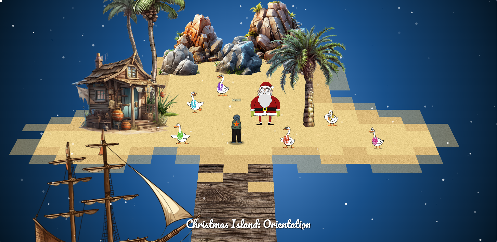
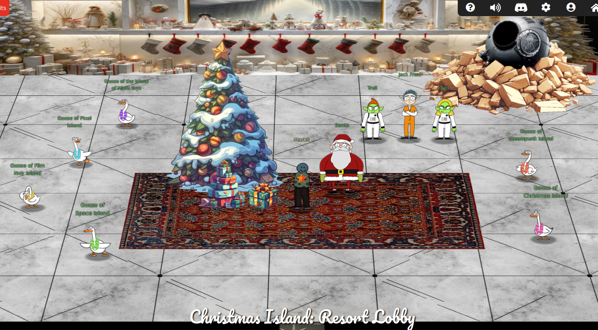

# Welcome

## Introduction

This year's Holiday Hack has moved to warmer climates, but not all is sunshine and rainbows.

With the assistance of the AI ChatNPT, infrastructure has been stood up, but there are concerns and so we are brougt in to evaluate. 

We check in at Orientation, collect our badge, a fishing pole and our own boat and set sail.  

AI tools are currently all the rage. There is a lot of evidence that, when done right, AI tools are a game changer. Being able to assist in dealing with large datasets, being able to provide feedback quickly on those datasets, and helping to improve productivity.

However, this is still a newer technology, and the ramifications and flaws are still being discovered. Whether it's bad training data, poor prompting, or data privacy concerns, there's a lot to work out.

Let's strive to work through these challenges so we can traverse these waters well, and not get shipwrecked in this storm.

??? tip "Navigation tip"
    Even with less than 50 pages, there's still quite a bit of information to read through. To make things a little easier, you can use ++"P"++ or ++","++ to go to the previous section, ++"N"++ or ++"."++ to navigate to the next section, and ++"S"++, ++"F"++, or ++"/"++ to open up the search dialog.

    **TL;DR** if you keep pressing ++"N"++ or ++"."++ from this point forward, you'll hit all the content in the right order! :smile:

## Answers

!!! success "1. Snowball Fight - <i class=twemoji_red>:fontawesome-solid-tree::fontawesome-solid-tree:</i>:fontawesome-solid-tree::fontawesome-solid-tree::fontawesome-solid-tree:"
    See [Solution](./objectives/o1_ci_sh.md).

!!! success "2. Linux 101 - <i class=twemoji_red>:fontawesome-solid-tree:</i>:fontawesome-solid-tree::fontawesome-solid-tree::fontawesome-solid-tree::fontawesome-solid-tree:"
    See [Solution](./objectives/o2_ci_l101.md).

!!! success "3. Reportinator - <i class=twemoji_red>:fontawesome-solid-tree::fontawesome-solid-tree:</i>:fontawesome-solid-tree::fontawesome-solid-tree::fontawesome-solid-tree:"
    See [Solution](./objectives/o3_ci_rep.md).

!!! success "4. Azure 101 - <i class=twemoji_red>:fontawesome-solid-tree::fontawesome-solid-tree:</i>:fontawesome-solid-tree::fontawesome-solid-tree::fontawesome-solid-tree:"
    See [Solution](./objectives/o4_ci_az101.md).

!!! success "5. Luggage Lock - <i class=twemoji_red>:fontawesome-solid-tree:</i>:fontawesome-solid-tree::fontawesome-solid-tree::fontawesome-solid-tree::fontawesome-solid-tree:"
    See [Solution](./objectives/o5_mt_ll.md).

!!! success "6. Linux PrivEsc - <i class=twemoji_red>:fontawesome-solid-tree::fontawesome-solid-tree::fontawesome-solid-tree:</i>:fontawesome-solid-tree::fontawesome-solid-tree:"
    [Santa](./objectives/o6_mt_priv.md)

!!! success "7. Faster Lock Combination - <i class=twemoji_red>:fontawesome-solid-tree::fontawesome-solid-tree:</i>:fontawesome-solid-tree::fontawesome-solid-tree::fontawesome-solid-tree:"
    See [Solution](./objectives/o7_si_flc.md).

!!! success "8. Game Cartridges: Vol 1 - <i class=twemoji_red>:fontawesome-solid-tree:</i>:fontawesome-solid-tree::fontawesome-solid-tree::fontawesome-solid-tree::fontawesome-solid-tree:"
    [santaconfusedgivingplanetsqrcode ](./objectives/o8_gc1.md)

!!! success "9. Game Cartridges: Vol 2 - <i class=twemoji_red>:fontawesome-solid-tree::fontawesome-solid-tree::fontawesome-solid-tree:</i>:fontawesome-solid-tree::fontawesome-solid-tree:"
    [GL0RY](./objectives/o9_gc2.md)

!!! success "10. Game Cartridges: Vol 3 - <i class=twemoji_red>:fontawesome-solid-tree::fontawesome-solid-tree::fontawesome-solid-tree:</i>:fontawesome-solid-tree::fontawesome-solid-tree:"
    [!tom+elf!](./objectives/o10_gc3.md)

!!! success "11. Na'an - <i class=twemoji_red>:fontawesome-solid-tree::fontawesome-solid-tree:</i>:fontawesome-solid-tree::fontawesome-solid-tree::fontawesome-solid-tree:"
    See [Solution](./objectives/o11_fn_nan.md).

!!! success "12. KQL Kraken Hunt - <i class=twemoji_red>:fontawesome-solid-tree::fontawesome-solid-tree:</i>:fontawesome-solid-tree::fontawesome-solid-tree::fontawesome-solid-tree:"
    [Beware the Cube that Wombles](./objectives/o12_fn_kql.md)

!!! success "13. Phish Detection Agency - <i class=twemoji_red>:fontawesome-solid-tree::fontawesome-solid-tree:</i>:fontawesome-solid-tree::fontawesome-solid-tree::fontawesome-solid-tree:"
    See [Solution](./objectives/o13_fn_phish.md).

!!! success "14. Hashcat - <i class=twemoji_red>:fontawesome-solid-tree::fontawesome-solid-tree:</i>:fontawesome-solid-tree::fontawesome-solid-tree::fontawesome-solid-tree:"
    [IluvC4ndyC4nes!](./objectives/o14_mt_hash.md)

!!! success "15. Elf Hunt - <i class=twemoji_red>:fontawesome-solid-tree::fontawesome-solid-tree::fontawesome-solid-tree:</i>:fontawesome-solid-tree::fontawesome-solid-tree:"
    See [Solution](./objectives/o15_pi_eh.md).

!!! success "16. Certificate SSHenanigans - <i class=twemoji_red>:fontawesome-solid-tree::fontawesome-solid-tree::fontawesome-solid-tree::fontawesome-solid-tree::fontawesome-solid-tree:</i>"
    [Gingerbread Cookie Cache](./objectives/o16_pi_ssh.md)

!!! success "17. The Captain's Comms - <i class=twemoji_red>:fontawesome-solid-tree::fontawesome-solid-tree::fontawesome-solid-tree::fontawesome-solid-tree::fontawesome-solid-tree:</i>"
    See [Solution](./objectives/o17_si_cc.md).

!!! success "18. Active Directory - <i class=twemoji_red>:fontawesome-solid-tree::fontawesome-solid-tree::fontawesome-solid-tree::fontawesome-solid-tree:</i>:fontawesome-solid-tree:"
    [InstructionsForEnteringSatelliteGroundStation.txt](./objectives/o18_si_ad.md)

!!! success "19. Space Island Door Access Speaker - <i class=twemoji_red>:fontawesome-solid-tree::fontawesome-solid-tree::fontawesome-solid-tree:</i>:fontawesome-solid-tree::fontawesome-solid-tree:"
    See [Solution](./objectives/o19_sp_door.md).

!!! success "20. Camera Access - <i class=twemoji_red>:fontawesome-solid-tree::fontawesome-solid-tree::fontawesome-solid-tree:</i>:fontawesome-solid-tree::fontawesome-solid-tree:"
    [CONQUER HOLIDAY SEASON!](./objectives/o20_sp_camera.md)

!!! success "21. Missile Diversion - <i class=twemoji_red>:fontawesome-solid-tree::fontawesome-solid-tree::fontawesome-solid-tree::fontawesome-solid-tree::fontawesome-solid-tree:</i>"
    See [Solution](./objectives/o21_sp_diversion.md).

!!! success "Bonus! Fishing Guide- <i class=twemoji_red>:fontawesome-solid-tree:</i>:fontawesome-solid-tree::fontawesome-solid-tree::fontawesome-solid-tree::fontawesome-solid-tree:"
    See [Solution](./objectives/bonus_guide.md).

!!! success "Bonus! Fishing Mastery- <i class=twemoji_red>:fontawesome-solid-tree::fontawesome-solid-tree::fontawesome-solid-tree::fontawesome-solid-tree:</i>:fontawesome-solid-tree:"
    See [Solution](./objectives/bonus_master.md).

## Conclusion

!!! Abstract "Narrative"
    Just sit right back and you’ll hear a tale, 
    A tale of a yuletide trip 
    That started from a tropic port, 
    Aboard this tiny ship 
    Santa and his helpful elves 
    To Geese Islands did go 
    Continuing their merry work 
    O'er sand instead of snow 
    New this year: a shiny tool 
    The elves logged in with glee 
    What makes short work of many tasks? 
    It's ChatNPT. It's ChatNPT 
    From images to APIs 
    This AI made elves glad 
    But motivations were unknown 
    So was it good or bad? 
    Could it be that NPT 
    Was not from off-the-shelf? 
    Though we'll forgive and trust again 
    We'd found a naughty elf 
    This fancy AI tool of ours 
    With all our work remained 
    Not good or bad, our online friend 
    Just did as it was trained 
    Surely someone's taint must be 
    Upon our AI crutch 
    Yes indeed, this bold new world 
    Bore Jack Frost's icy touch 
    Though all's returned to steady state 
    There's one thing that we know 
    We'll all be needed once again 
    When Santa's back on snow 
     

