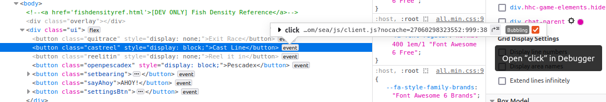
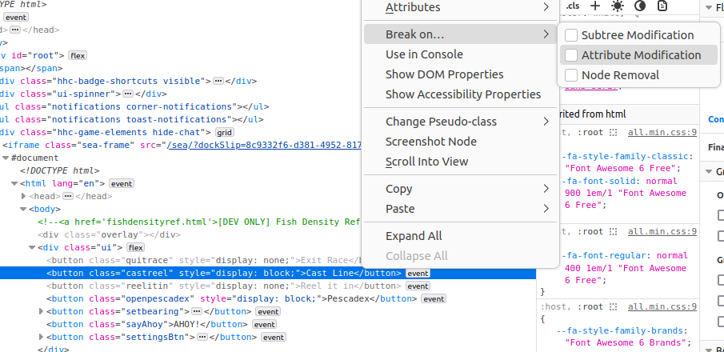
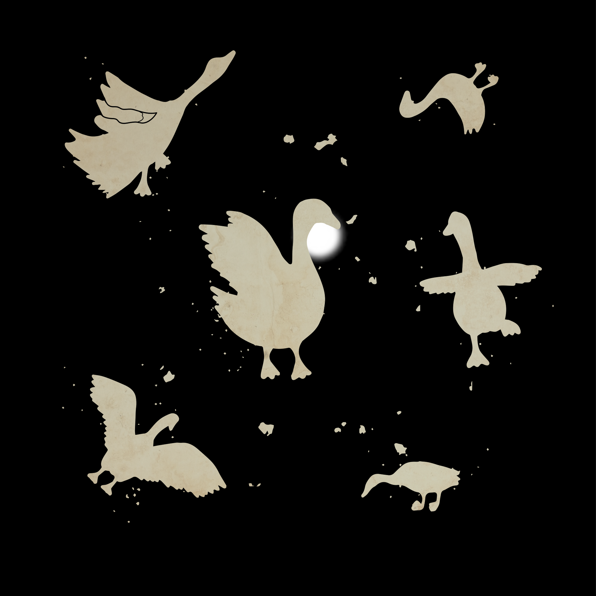
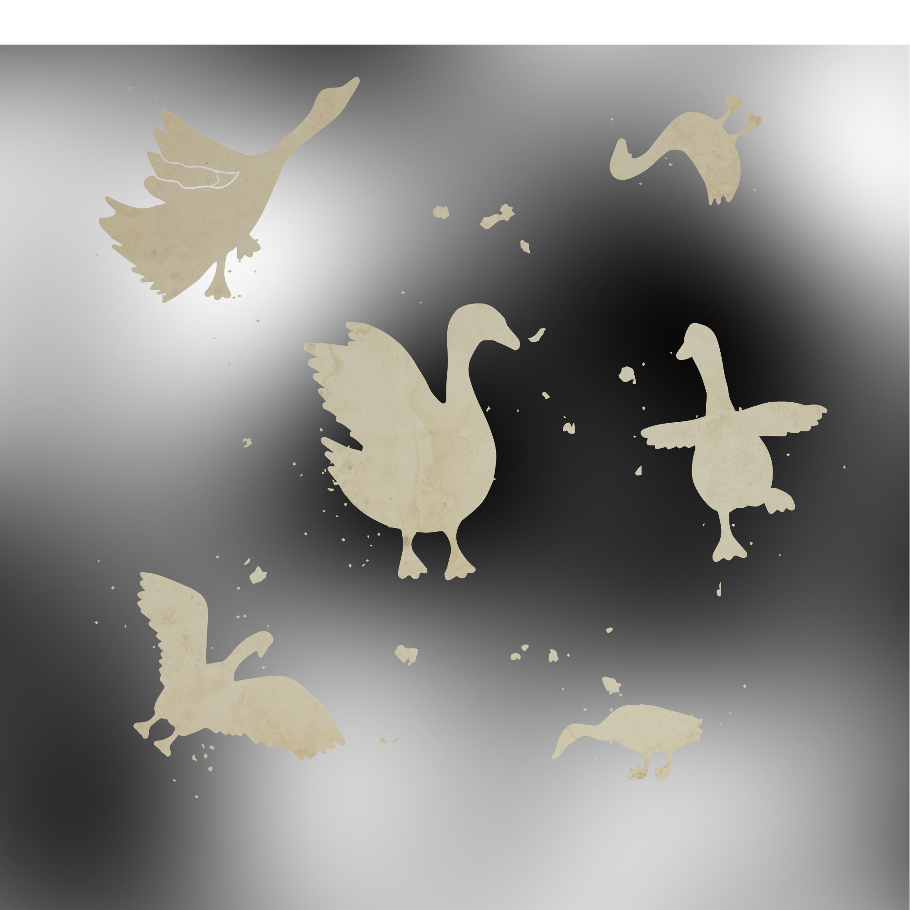

# BONUS! Fishing Mastery

**Difficulty**: <i class=twemoji_red>:fontawesome-solid-tree::fontawesome-solid-tree::fontawesome-solid-tree::fontawesome-solid-tree:</i>:fontawesome-solid-tree:<br/>
**Direct link**: [Objective 2 website](https://.../)

## Objective

!!! question "Request"
    Catch at least one of each species of fish that live around Geese islands. When you're done, report your findings to Poinsettia McMittens.

## Hints

??? tip "Fishing Machine"
    There are a variety of strategies for automating repetative website tasks. Tools such as [AutoKey](https://github.com/autokey/autokey) and [AutoIt](https://www.autoitscript.com/site/) allow you to programmatically examine elements on the screen and emulate user inputs.

??? tip "I Am Become Data"
    One approach to automating web tasks entails the browser's developer console. Browsers' console allow us to manipulate objects, inspect code, and even interact with [websockets](https://javascript.info/websocket).

??? tip "Become the Fish"
    Perhaps there are some clues about the local aquatic life located in the HTML source code.

## Solution

Certainly not catching every fish at least once manually. 

I used the Developer tools to inspect the cast button and check the code handling the casting andr reeling

<figure markdown>
{width="900"}
</figure>

```javascript
const castReelBtn = document.querySelector('button.castreel');
castReelBtn.addEventListener('click', () => {
    socket.send(`cast`);
    window.top.postMessage({
      type: 'sfx',
      filename: 'fishing-cast.mp3',
    }, '*');
});

const reelItInBtn = document.querySelector('button.reelitin');
reelItInBtn.addEventListener('click', () => {
    socket.send(`reel`);
    window.top.postMessage({
      type: 'sfx',
      filename: 'fishing-reel.mp3',
    }, '*');
});
```
Here we see the cast and reel are web socket.send actions.
I also added a break on modification of the cast button to see what was triggering the change

<figure markdown>
{width="700"}
</figure>

```javascript
if (me.fishing) {
        reelItInBtn.style.display = 'block';
        if (me.onTheLine) {
            reelItInBtn.classList.add('gotone');
            reelItInBtn.innerText = 'Reel it in!';
        } else {
            reelItInBtn.classList.remove('gotone');
            reelItInBtn.innerText = 'Reel it in';
        }
```
Here we see that when something is "onTheLine", the classlist for the button changes, adding "gotone"

In light of that, I needed to socket.send(`cast`);, watch for the classlist to change, socket.send(`reel`);, close the pescadex, and then loop until I had all of the fish.

Looking at the HTML of the page, I do see this commented out:
```html
  <!-- <a href='fishdensityref.html'>[DEV ONLY] Fish Density Reference</a> -->
```
accessing https://2023.holidayhackchallenge.com/fishdensityref.html provides a heat map of all of the fish. Looking throgh, there is one fish, the Piscis Cyberneticus Skodo, that has an extremely narrow fishing ground. Overlaying that with the ocean map gives us a location to start fishing

<figure markdown>
{width="500"}
</figure>

With a little help from ChatGPT, we created this javascript to keep fishing until we caught them all. In Firefox, I did have to inspect the Cast button, and "debug" that in order to load and use the already defined names, such as "reelItInBtn". 
I also had to tweak the timing. Without the pauses, I found that it would end up hanging and I surmised that it was running through the commands too fast, and so would end up at a point waiting for "gotone", but the line hadn't been cast and so I'd have to just click "Cast" and things would continue.

```javascript title="Auto Fish"
// Select the button you want to monitor
// var targetButton = document.querySelector('.yourButtonClassName');
var targetIndex = 170 //index goes from 0-170 totaling 171 types

// Function to create a MutationObserver and return a promise
function observeButtonChanges() {
  return new Promise(resolve => {
    var observer = new MutationObserver(function(mutations) {
      mutations.forEach(function(mutation) {
        if (mutation.type === 'attributes' && mutation.attributeName === 'class' && mutation.target.classList.contains('gotone')) {
          // Button class name changed, resolve the promise
          resolve();
        }
      });
    });

    // Configure the observer to watch for attribute changes
    var config = { attributes: 'gotone', attributeFilter: ['class'] };

    // Start observing the target button with the specified configuration
    observer.observe(reelItInBtn, config);
  });
}

// Example usage in a do-while loop
async function executeWithMutationObserver() {
  do {
    await new Promise(resolve => setTimeout(resolve, 500));
    // Your other logic here
    socket.send(`cast`);
    await new Promise(resolve => setTimeout(resolve, 500));
    // Wait for the MutationObserver to execute
    await observeButtonChanges();
    await new Promise(resolve => setTimeout(resolve, 100));
    socket.send(`reel`);
    await new Promise(resolve => setTimeout(resolve, 1000));
    console.log('Caught '+ playerData.fishCaught[pescadexIndex].name + ' : '+ pescadexFINdexSeeWhatIDidThere.innerText)
    cotd.classList.remove('visible');
    await new Promise(resolve => setTimeout(resolve, 500));
    // Continue with the loop or additional logic
  } while (pescadexIndex <= targetIndex);
}

// Start the loop
executeWithMutationObserver();
```

I let that go overnight, and by morning, we caught 170 of 171. 

To find the one we haven't caught yet, I used the following

```javascript 
// I ran this against the fishdensityref.html page to just get all of the names and put them in an array
var devfish = Array.from(document.getElementsByTagName('h3')).map(function(element) {
  return element.innerText;
}); 
// this I just referenced the pescadex
var fishcaughtlist = playerData.fishCaught.map(function(obj) {
  return obj.name;
});
// and compared the two arrays
var tobecaught = devfish.filter(function(element) {
  return fishcaughtlist.indexOf(element) === -1;
});

tobecaught
Array [ "Gumball Glooperfish" ]
```
Looking for the Gumball Glooperfish, I did the same thing to find the previous fishing spot. I overlayed Gumball's heat map over the island map:

<figure markdown>
{width="500"}
</figure>

Picked a new fishing spot, and cast the line again, and let the loop go until I caught the Gumball.


!!! success "Answer"
    

## Response

!!! quote "Poinsettia McMittens"
    You managed to catch every fish? You're like the fishing version of a Christmas miracle!</br>
    Now, if only you could teach me your ways... but then again, I'm already pretty fabulous at everything I do.
