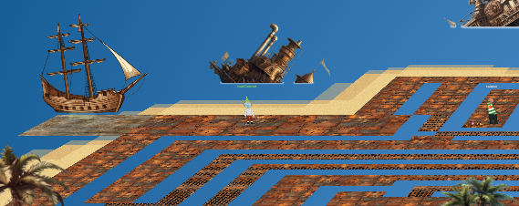
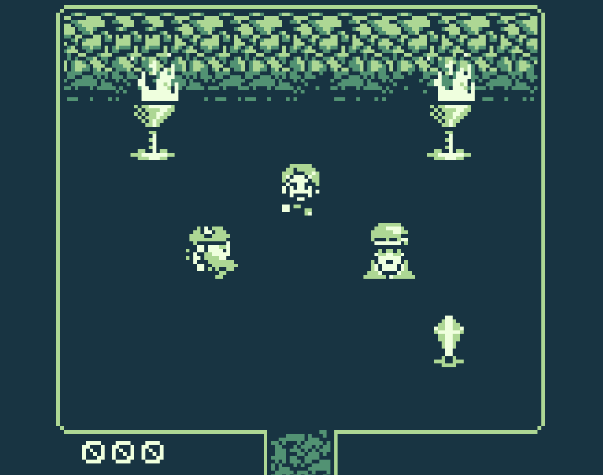
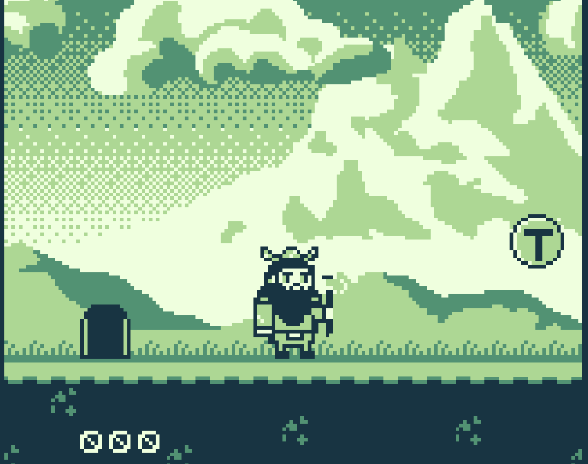
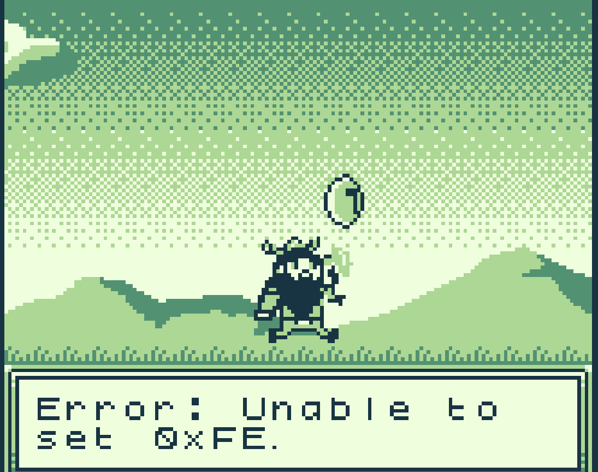
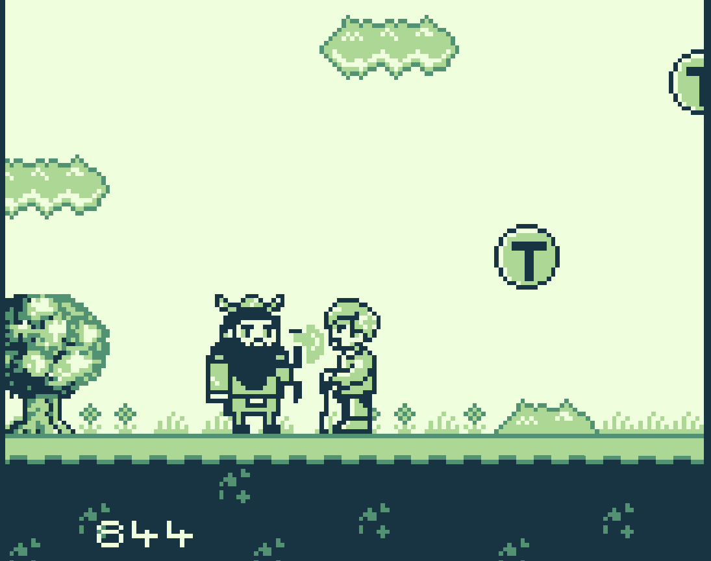
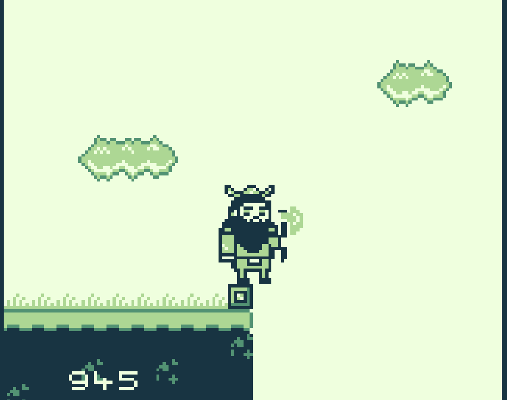
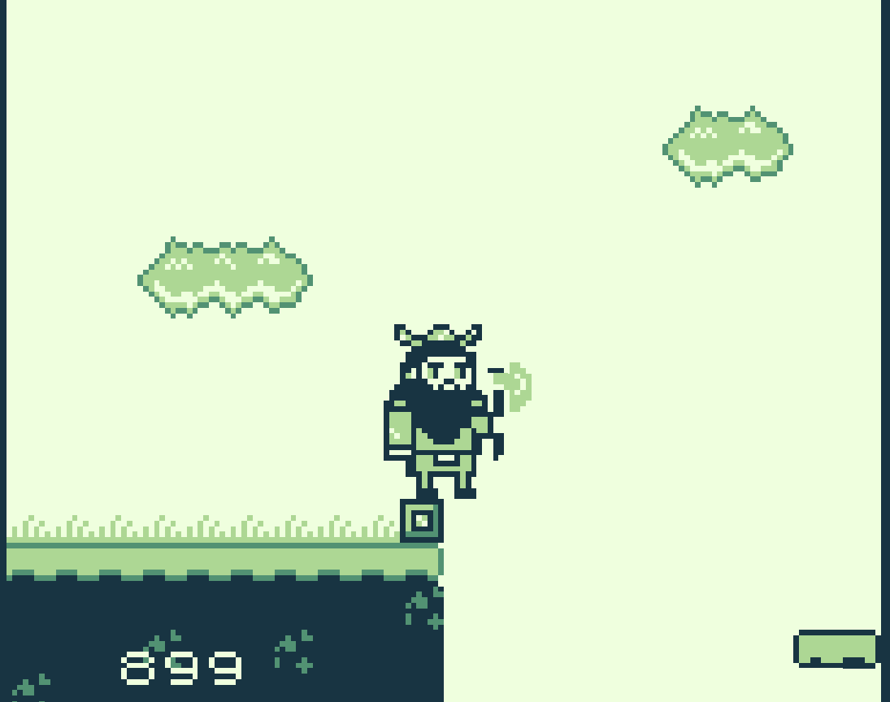
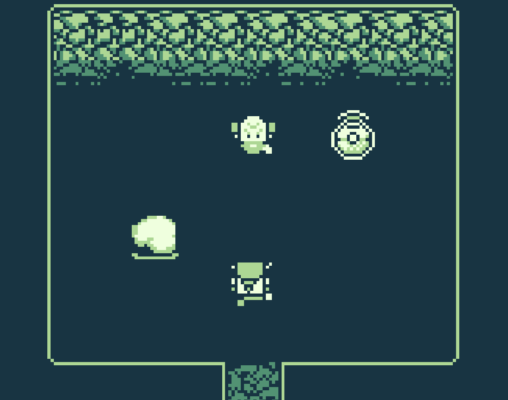
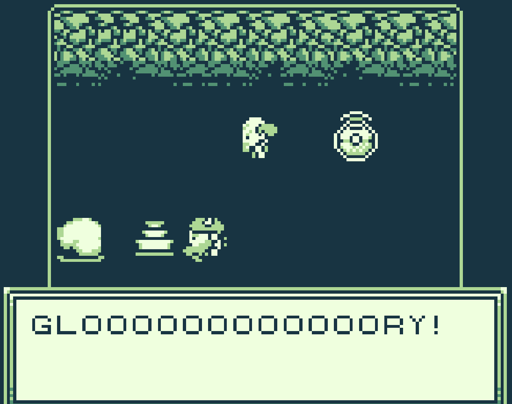
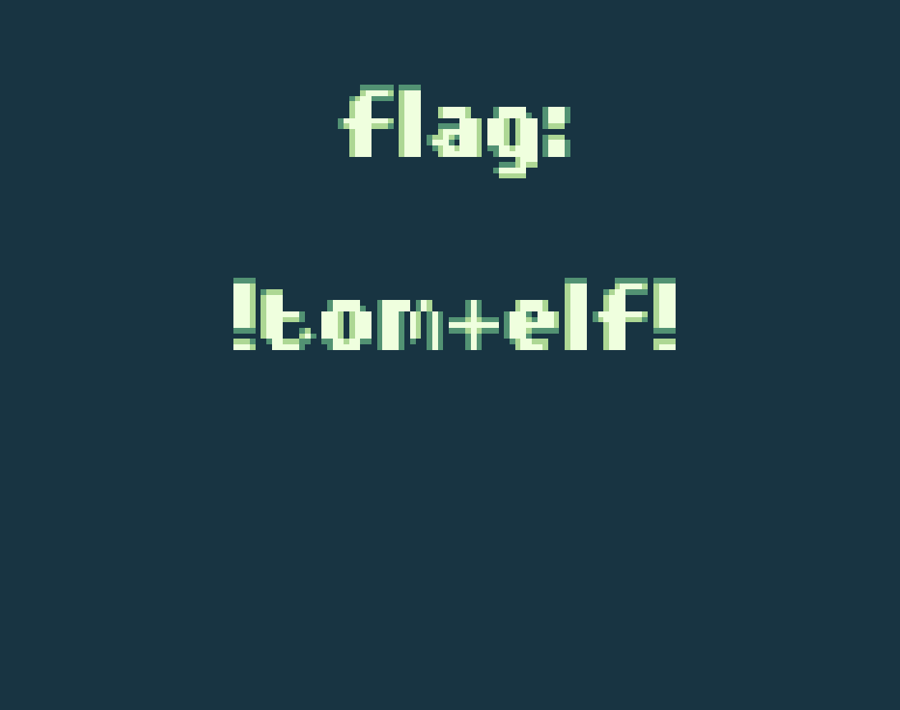

# Game Cartridges: Vol 3

**Difficulty**: <i class=twemoji_red>:fontawesome-solid-tree::fontawesome-solid-tree::fontawesome-solid-tree:</i>:fontawesome-solid-tree::fontawesome-solid-tree:<br/>
**Direct link**: [GameBoy3](https://gamegosling.com/vol3-7bNwQKGBFNGQT1/index.html?&challenge=gameboy3)

## Objective

!!! question "Request"
    Find the third Gamegosling cartridge and beat the game

??? quote "Angel Candysalt"
    The name's Angel Candysalt, the great treasure hunter!<br/>
    A euphemism? No, why do people always ask me that??<br/>
    Anyways, I came here to nab the treasure hidden in this ship graveyard, only to discover it's protected by this rusted maze.<br/>
    That must be why all these old ships are here. Their crew came to find the treasure, only to get lost in the labrynth.<br/>
    <br/>
    There are 3 buried treasures in total, each in its own uncharted area around Geese Islands.<br/>
    I've been getting lost in this maze for hours now with no luck, and my feet are starting to get sore.<br/>
    Maybe you'll be able to find the way through. Here, use my Gameboy Cartridge Detector. Go into your items and test it to make sure it's still working.<br/>
    When you get close to the treasure, it'll start sounding off. The closer you get, the louder the sound.<br/>
    No need to activate or fiddle with it. It just works!<br/>
    At least it's obvious where this one is. See that shiny spot over to the right? That's gotta be where it is! If only I had a bird's eye view.<br/>
    But how to get there? Up? Down? Left? Right? Oh well, that's your problem now!<br/>
    Come back if you can find your way to it, and I'll tell you some secrets I've heard about this one.


## Hints

??? tip "Gameboy 3"
    1) This one is a bit long, it never hurts to save your progress! 2) 8bit systems have much smaller registers than you’re used to. 3) Isn’t this great?!? The coins are OVERFLOWing in their abundance.

??? tip "Bird's Eye View"
    The location of the treasure in Rusty Quay is marked by a shiny spot on the ground. To help with navigating the maze, try zooming out and changing the camera angle.

## Solution

Going to Steampunk Island, Rusty Quay port, We can see where the Rom is, but how to get there

<figure markdown>
{ width="700"}
</figure>

We can try to find a position and zoom our browser out to get the whole picture, or we can go to the developer tools, and inspect the page:

``` html
<div class="floor" alt="" style="width: 7400px; height: 8800px; transform: translate3d(0px, 0px, 0px) rotateX(90deg); background: url(&quot;images/fabric/spi-rustyquay_floor.png&quot;) no-repeat;"></div>
```
We download spi-rustyquay_floor.png and look at that and trace our path:

<figure markdown>
{ width="700"}
</figure>

Now that we have the rom for Vol3, we load that up and check it out

!!! quote ""
    { width="400" align="left"}
    { width="400" align="right"}
    </br>*PREVIOUSLY ON*...</br>Elf: GLOOOOOR....</br>T-wiz: Just a second Elf. As Vol3 seems pretty buggy and coins seem to disappear after you save. You should know that my magic is available.</br>Elf: Oh! *cough* Thanks for letting me know! GLOOOOOOOOOOORY!

Looks like we've moved to Super Mario Bros, and collecting coins. We appear to have 5 screens of coins with some turnip goomba's, which send us back to the start. Screen 2-4 have coin valuses of ones, tens, and hundreds. Screen 1 and 5 have all values.
If we collect more than 990, but less than 999, and the next coin reach 999 or more, then the total just goes over and we start back at 0. but if we go to 989 and collect a 10 coin, or 899 and collect a 100 coin, then we get an error

<figure markdown>
{ width="400"}
</figure>

On Screen 5 we run into Jared who gives us an indication that we need 9's

<figure markdown>
{ width="500"}
<figcaption>Jared: Back in my SysAdmin days marketing always loved talking about [5] nines. But we all know it was more like [3] nines.</figcaption>
</figure>

And at the end of screen 5, we come to a ledge and if we have different coin values we see something different

!!! quote ""
    { width="400" align="left"}
    { width="400" align="right"}
    </br> <------------------------------------ When we have less than x99 we see nothing but a ledge </br></br></br></br>But if we have x99 coins, we see a ledge we can jump to</br> ------------------------------------>

We jump over to the other side and find another room:

!!! quote ""
    { width="400" align="left"}
    { width="400" align="right"}
    </br> Elf: If by "never" you mean I've filled my treasure pouch to the brim with coins, then yes, I agree! I have "never" found this many crypto coins! GLOOOOOOOOOOORY! *Elf shows Liston all his coins* </br> Liston: How in the world did you... never mind. Say this passphrase "morethanmeetstheeye" to the ChatNPT thinger and then give it all your coins!

!!! success "Answer"
    { width="400" align="left"}

## Response

!!! quote "Angel Candysalt"
    The life of a treasure hunter isn't easy, but it sure is exciting!<br/>
    Oh it's a video game, I love video games! But you've claimed this treasure, nicely done.<br/>
    Now, about those secrets I've been told. They're pretty cryptic, but they are. Hopefully that helps with something!<br/>
    <br/>
    You have all three? Wow, you must be the greatest treasure hunter that ever lived!
