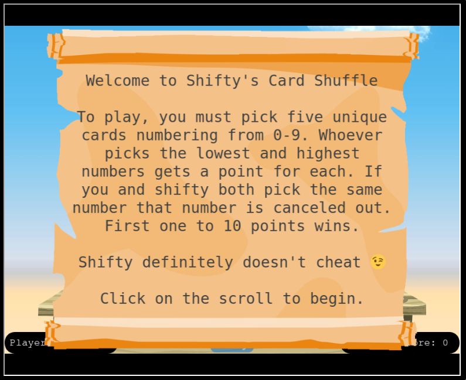
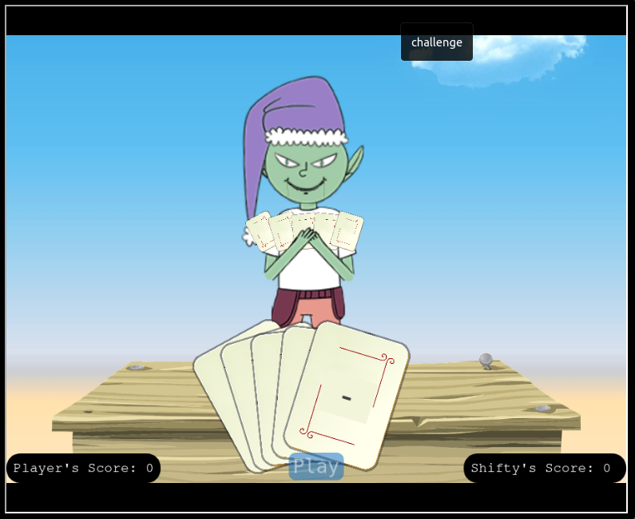
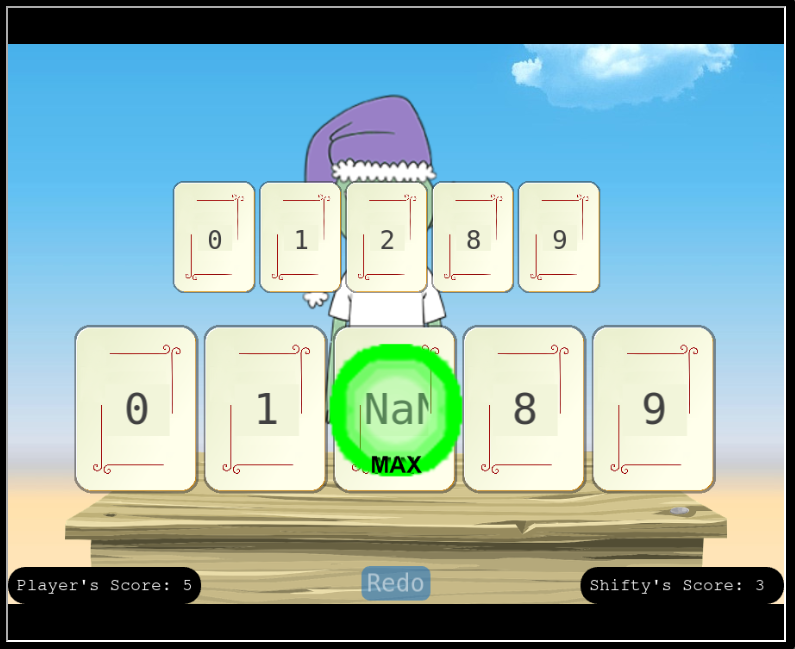
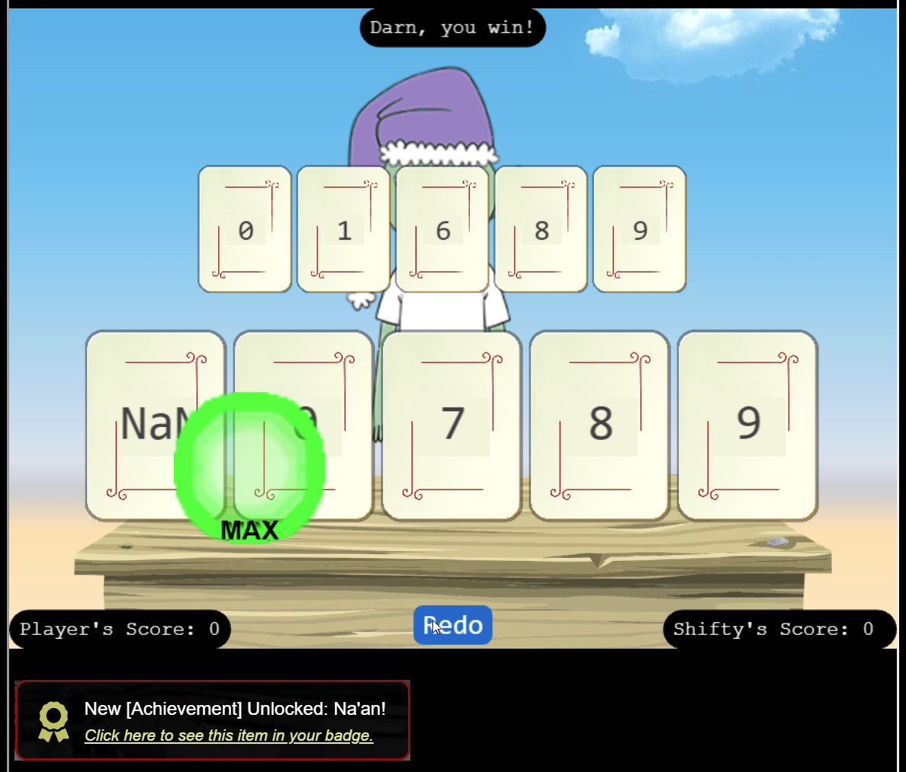

# Na'an

**Difficulty**: <i class=twemoji_red>:fontawesome-solid-tree::fontawesome-solid-tree:</i>:fontawesome-solid-tree::fontawesome-solid-tree::fontawesome-solid-tree: 
**Direct link**: [Na'an](https://nannannannannannan.com?&challenge=naan)

## Objective

!!! question "Request"
    Shifty McShuffles is hustling cards on Film Noir Island. Outwit that meddling elf and win!

??? quote "Shifty McShuffles"
    Hey there, stranger! Fancy a game of cards? Luck's on your side today, I can feel it. 
    Step right up, test your wit! These cards could be your ticket to fortune. 
    Trust me, I've got a good eye for winners, and you've got the look of luck about you. 
    Plus, I'd wager you've never played this game before, as this isn't any ordinary deck of cards. It's made with [Python](https://www.tenable.com/blog/python-nan-injection). 
    The name of the game is to bamboozle the dealer. 
    So whad'ya think? Are you clever enough?

## Hints

??? tip "The Upper Hand"
    Shifty said his deck of cards is made with Python. Surely there's a [weakness](https://www.tenable.com/blog/python-nan-injection) to give you the upper hand in his game.

??? tip "Stump the Chump"
    Try to outsmart Shifty by sending him an error he may not understand.

## Solution

!!! quote ""
    { width="400" align="left"}
    { width="400" align="right"}
     

Python has issues with strings that are "Not a Number". So unless you are performing checks and validation to address circumstances that result in NaN, then actors could use this to their advantage. As Shifty is checking numbers, lookin for high and low card and giving points accordingly, let's see if we can set one of the cards to "NaN"

<figure markdown>
{ width="400"}
</figure>

I'm certain that Shifty does not want this to happen. He'll need to add some checks. We'll repeat this until:

!!! success "Answer"
    { width="400" }

## Response

!!! quote "Shifty McShuffles"
    Well, you sure are more clever than most of the tourists that show up here. 
    I couldn't swindle ya, but don't go telling everyone how you beat me! 
    An elf's gotta put food on the table somehow, and I'm doing the best I can with what I got.
