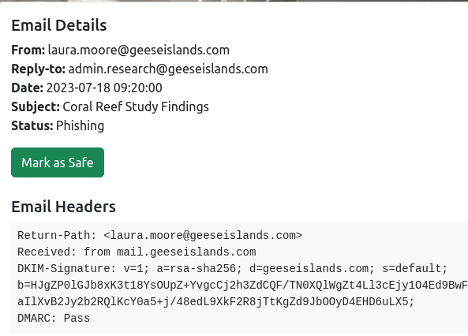
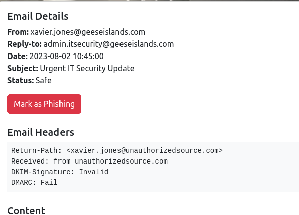
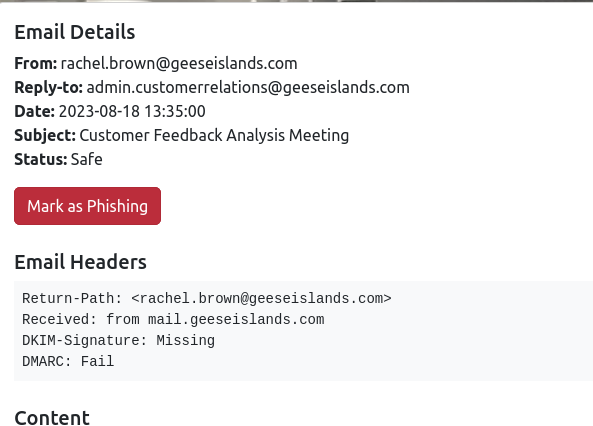
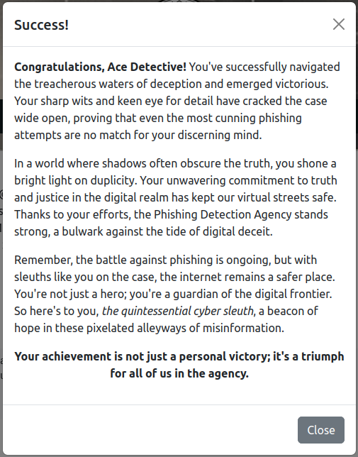

# Phish Detection Agency

**Difficulty**: <i class=twemoji_red>:fontawesome-solid-tree::fontawesome-solid-tree:</i>:fontawesome-solid-tree::fontawesome-solid-tree::fontawesome-solid-tree: 
**Direct link**: [Phish Detection](https://hhc23-phishdetect-dot-holidayhack2023.ue.r.appspot.com/?&challenge=phishdetect)

## Objective

!!! question "Request"
    Fitzy Shortstack on Film Noir Island needs help battling dastardly phishers. Help sort the good from the bad!

??? quote "Fitzy Shortstack"
    Just my luck, I thought... 
    A cybersecurity incident right in the middle of this stakeout. 
    Seems we have a flood of unusual emails coming in through ChatNPT. 
    Got a nagging suspicion it isn't catching all the fishy ones. 
    You're our phishing specialist right? Could use your expertise in looking through the output of ChatNPT. 
    Not suggesting a full-blown forensic analysis, just mark the ones screaming digital fraud. 
    We're looking at all this raw data, but sometimes, it takes a keen human eye to separate the chaff, doesn't it? 
    I need to get more powdered sugar for my donuts, so do ping me when you have something concrete on this.

## Hints

??? tip "DMARC, DKIM, and SPF, oh my!"
    Discover the essentials of email security with DMARC, DKIM, and SPF at [Cloudflare's Guide](https://www.cloudflare.com/learning/email-security/dmarc-dkim-spf/).

## Solution

DMARC, DKIM, and SPF work together to determine if an email is truly from the recipient.

DKIM provided the ability to sign a message where a recipient email can verify it's authenticity

SPF will inform recipient domains what email servers are intended to be used to send emails on behalf of the sender's domain.

DMARC tells the recipient domain what to do if a DKIM or SPF check fails.

Here is an example email that was marked as phishing incorrectly:

!!! info "Example Incorrect Phishing Designation"
    { width="400" align="left"}
      <-- Sender shows as geeseislands
           <-- Matches Return Path and Received From
     <-- DKIM Signature Passes
      <-- DMARC Passes

Where this is an example of missing an email that should be marked as phishing
!!! info "Example Missed Phishing Designation"
    { width="400" align="left"}
      <-- Sender shows as geeseislands
           <-- Does NOT match Return Path and Received From
     <-- DKIM Signature does NOT pass
      <-- DMARC Fails

Emails that are from our domain, and appear to originate from our domain, but are not signed by our email server are also not legitimate and should be considered phishing 

!!! info "Example DKIM Failure"
    { width="400" align="left"}
      <-- Sender shows as geeseislands
           <-- Does match Return Path and Received From
      <-- Missing DKIM Signature indicates did not come from geeseislands server
     <-- DMARC Fails

So those are some examples of what we are looking for. After review of all emails, the following were incorrectly marked and now show the corrected state

So we look through the emails and make sure that those emails that failed are marked as spam, and those that did not fail are marked as safe. Checking the senders, reply to, received from, DKIM, and DMARC checks to validate.

| From         		            | Subject                             | Corrected State |
| :---------------------------- | :---------------------------------- | :-------------- |
|laura.moore@geeseislands.com   |Coral Reef Study Findings            |Safe     |X
|quentin.adams@geeseislands.com |Quality Assurance Protocols Meeting  |Safe     |X
|xavier.jones@geeseislands.com  |Urgent IT Security Update            |Phishing |X
|john.doe@geeseislands.com      |Pacific Festive Celebrations Overview|Safe     |X
|uma.foster@geeseislands.com    |Operational Efficiency Review        |Safe     |X
|rachel.brown@geeseislands.com  |Customer Feedback Analysis Meeting   |Phishing |X
|ursula.morris@geeseislands.com |Legal Team Expansion Strategy        |Phishing |X
|michael.roberts@geeseislands.com|Compliance Training Schedule Announcement|Phishing|X
|alice.smith@geeseislands.com   |Summer Beach Cleanup Coordination    |Safe     |X
|frank.harrison@geeseislands.com|Annual Budget Review and Forecasting |Safe     |X
|xavier.edwards@geeseislands.com|Year-End Sales Target Strategies     |Safe     |X
|oliver.thomas@geeseislands.com |New Research Project Kickoff         |Phishing |X
|teresa.green@geeseislands.com  |Financial Planning for 2024          |Safe     |X

!!! success "Answer"
    { width="400" }

## Response

??? quote "Fitzy Shortstack"
    You've cracked the case! Once again, you've proven yourself to be an invaluable asset in our fight against these digital foes.
