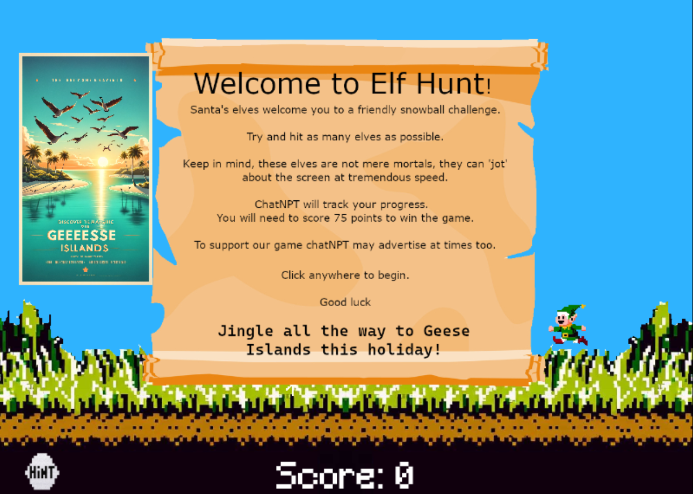
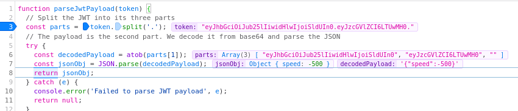
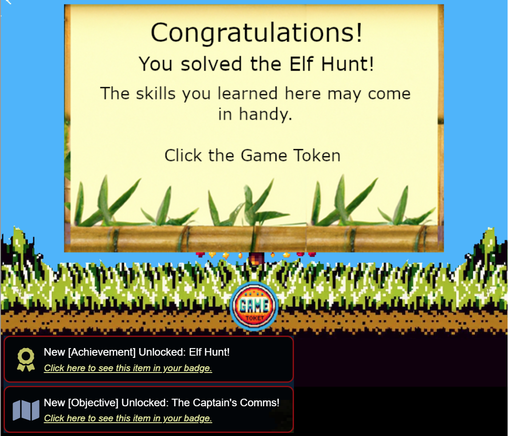

# Elf Hunt

**Difficulty**: <i class=twemoji_red>:fontawesome-solid-tree::fontawesome-solid-tree::fontawesome-solid-tree:</i>:fontawesome-solid-tree::fontawesome-solid-tree:<br/>
**Direct link**: [Elf Hunt](https://elfhunt.org/?&challenge=elfhunt)

## Objective

!!! question "Request"
    Piney Sappington needs a lesson in JSON web tokens. Hack Elf Hunt and score 75 points.

??? quote "Piney Sappington"
    Hey there, friend! Piney Sappington here.<br/>
    You look like someone who's good with puzzles and games.<br/>
    I could really use your help with this Elf Hunt game I'm stuck on.<br/>
    I think it has something to do with manipulating JWTs, but I'm a bit lost.<br/>
    If you help me out, I might share some juicy secrets I've discovered.<br/>
    Let's just say things around here haven't been exactly... normal.<br/>
    So, what do ya say? Are you in?<br/>
    Oh, brilliant! I just know we'll crack this game together.<br/>
    I can't wait to see what we uncover, and remember, mum's the word!<br/>
    Thanks a bunch! Keep your eyes open and your ears to the ground.

## Hints

??? tip "JWT Secrets Revealed"
    Unlock the mysteries of JWTs with insights from [PortSwigger's JWT Guide](https://portswigger.net/web-security/jwt).

??? tip "In Game"
    The elves are really fast aren't they. If there was only some way to slow them down. I wonder if they got into Santa's magic cookies? </br> **From frozen screens to tropical dreams:**

## Solution

<figure markdown>
{width="400"}
</figure>

Trying to hit these flying elves is not a simple feat.  Let's dive into how this game works. Looking at [main.js](https://elfhunt.org/static//js/main.js) we have a function to parse a jwt token.

```javascript
function parseJwtPayload(token) {
  // Split the JWT into its three parts
  const parts = token.split('.');
  // The payload is the second part. We decode it from base64 and parse the JSON
  try {
    const decodedPayload = atob(parts[1]);
    const jsonObj = JSON.parse(decodedPayload);
    return jsonObj;
  } catch (e) {
    console.error('Failed to parse JWT payload', e);
    return null;
  }
}
```
If we set some breakpoints, we can watch what's being parsed



Which then leads to the following setting the "speed" to the value grabbed from the JWT token.

```javascript
var scoreText,
scoreBox,
elves,
score = 0,
sessionKeyName = 'ElfHunt_JWT',
sessionJWT = null;
try {
  (sessionJWT = getDecodedJwtPayload(sessionKeyName)) &&
  sessionJWT.hasOwnProperty('speed') &&
  'number' == typeof sessionJWT.speed ||
  clearCookiesAndReload()
} catch (e) {
  console.error('An error occurred:', e),
  clearCookiesAndReload()
}
var speed = sessionJWT.speed,
numberOfImages = 6,
posterFlag = !1,
currentPoster = void 0;
```
Inspecting the JWT token, we have the following:

```javascript
ElfHunt_JWT:"eyJhbGciOiJub25lIiwidHlwIjoiSldUIn0.eyJzcGVlZCI6LTUwMH0."
```
JWT tokens are in three parts, with the first part being the header, second being the payload and third part being the signature. There is no signature in this JWT token, so we should be able to modify this and send our own values.

```bash title="Decoded JWT"
$ echo 'eyJhbGciOiJub25lIiwidHlwIjoiSldUIn0=' | base64 -d | jq
{
  "alg": "none",
  "typ": "JWT"
}
$ echo 'eyJzcGVlZCI6LTUwMH0=' | base64 -d | jq
{
  "speed": -500
}
```
Let's change the value from "-500" to "-100"

```bash
$ echo '{"speed": -100}' | base64
eyJzcGVlZCI6IC0xMDB9Cg==
```
I was able to use the Firefox developer tools, Storage > Cookies, and modify the cookie value directly and then refresh the page.

<figure markdown>
{width="500"}
</figure>


!!! success "Answer"
    {width="500"}

## Response

!!! quote "Piney Sappington"
    Well done! You've brilliantly won Elf Hunt! I couldn't be more thrilled. Keep up the fine work, my friend!</br>
    What have you found there? The Captain's Journal? Yeah, he comes around a lot. You can find his comms office over at Brass Buoy Port on Steampunk Island.
