# The Captains Comms

**Difficulty**: <i class=twemoji_red>:fontawesome-solid-tree::fontawesome-solid-tree::fontawesome-solid-tree::fontawesome-solid-tree::fontawesome-solid-tree:</i><br/>
**Direct link**: [Radio Hut](https://captainscomms.com/?&challenge=capcom)

## Objective

!!! question "Request"
    Speak with Chimney Scissorsticks on Steampunk Island about the interesting things the captain is hearing on his new Software Defined Radio. You'll need to assume the **GeeseIslandsSuperChiefCommunicationsOfficer** role.

??? quote "Chimney Scissorsticks"
    Heya, think you could help Piney Sappington on Rainraster Cliffs on Pixel Island and then give me a hand?<br/>
    <br/>
    Ahoy there, I'm Chimney Scissorsticks!<br/>
    You may have noticed some mischief-makers planning to stir up trouble ashore.<br/>
    They've made many radio broadcasts which the captain has been monitoring with his new software defined radio (SDR).<br/>
    The new SDR uses some fancy JWT technology to control access.<br/>
    The captain has a knack for shortening words, some sorta abbreviation trick.<br/>
    Not familiar with JWT values? No worries; just think of it as a clue-solving game.<br/>
    I've seen that the Captain likes to carry his journal with him wherever he goes.<br/>
    If only I could find the planned "go-date", "go-time", and radio frequency they plan to use.<br/>
    Remember, the captain's abbreviations are your guiding light through this mystery!<br/>
    Once we find a JWT value, these villains won't stand a chance.<br/>
    The closer we are, the sooner we'll be thwarting their pesky plans!<br/>
    We need to recreate an administrative JWT value to successfully transmit a message.<br/>
    Good luck, matey! I've no doubts about your cleverness in cracking this conundrum!<br/>

## Hints

??? tip "Comms Abbreviations"
    I hear the Captain likes to abbreviate words in his filenames; shortening some words to just 1,2,3, or 4 letters.

??? tip "Comms Web Interception Proxies"
    Web Interception proxies like [Burp](https://portswigger.net/burp) and [Zap](https://www.zaproxy.org/) make web sites fun!
    
??? tip "Comms Private Key"
    Find a private key, update an existing JWT!

??? tip "Comms JWT Intro"
    A great introduction to JSON Web Tokens is available from [Auth0](https://jwt.io/introduction).
    
??? tip "Comms Journal"
    I've seen the Captain with [his Journal](https://elfhunt.org/static/images/captainsJournal.png) visiting Pixel Island! 

## Solution


This section explains the different steps taken to solve the challenge. Try to find a good balance between providing sufficient detail and not overloading the reader with too much information. Use [admonitions](https://squidfunk.github.io/mkdocs-material/reference/admonitions/), [images](https://squidfunk.github.io/mkdocs-material/reference/images/), [diagrams](https://squidfunk.github.io/mkdocs-material/reference/diagrams/), [code blocks](https://squidfunk.github.io/mkdocs-material/reference/code-blocks/), and [tables](https://squidfunk.github.io/mkdocs-material/reference/data-tables/) to highlight and structure important information or provide additional clarification.

<figure markdown>
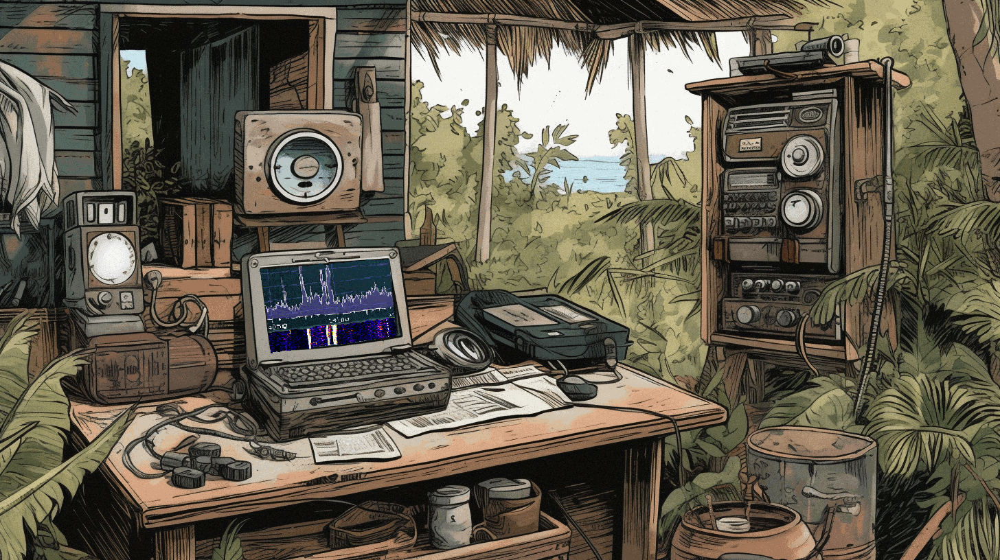{ width="500"}
</figure>

We try to access the Captain's SDR, but we are told we need to be a **radioMonitor**. We try to access the Captain's Transmitter, and we are told we need to be a **Radio Administrator**. 
We start reading through everything. The [Instructions](https://captainscomms.com/static/images/instructions.png), Owner's Manual [Vol 1](https://captainscomms.com/static/images/ownMan1.png), [Vol 2](https://captainscomms.com/static/images/ownMan2.png), [Vol 3](https://captainscomms.com/static/images/ownMan3.png), [Owner's Card](https://captainscomms.com/static/images/ownCard.png), [Captain's To-Do List](https://captainscomms.com/static/images/capNotes.png), and [ChatNPT Output](https://captainscomms.com/static/images/chatNPTList.png)

The Owner's Card tells us the default install directory is **/jwtDefault**, and radioMonitor is in that directory.
If we go to [https://captainscomms.com/jwtDefault/rMonitor.tok](https://captainscomms.com/jwtDefault/rMonitor.tok), we get a response of **Invalid authorization token provided**.

Looking at the traffic, when we try to access the Captain's SDR, it makes a request to /checkRole, and that includes an Authorization Header. Let's edit that request and resend to request rMonitor.tok

<figure markdown>
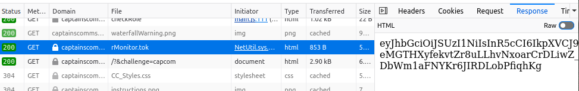{ width="900"}
</figure>

Looking at the response, it's a JWT Token, and checking the Cookies, we see a **justWatchThisRole** cookie. 

<figure markdown>
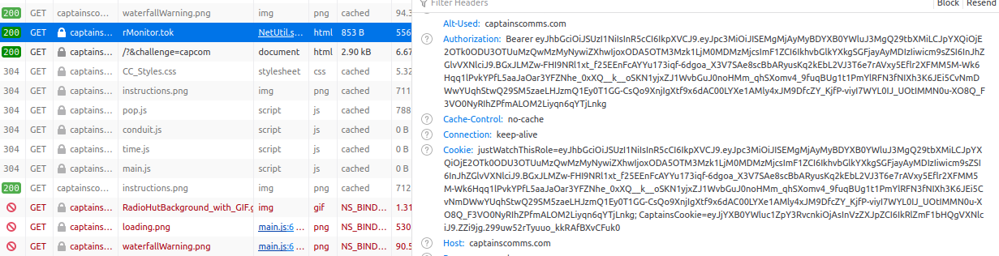{ width="900"}
</figure>

We replace the **justWatchThisRole** cookie with the rMonitor.tok token and that gives us access to the Captain's SDR.

<figure markdown>
{ width="400"}
</figure>

Now that we have access to the SDR, when we try to listen to a frequency, we are told we need to be a **radioDecoder**.
If the radioMonitor role was in /jwtDefault/rMonitor.tok, maybe radioDecoder is in /jwtDefault/rDecoder.tok.
Using rMonitor's JWT token as Authorization Header, we are able to access the rDecoder.tok

<figure markdown>
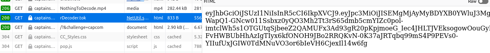{ width=900"}
</figure>


!!! quote ""
    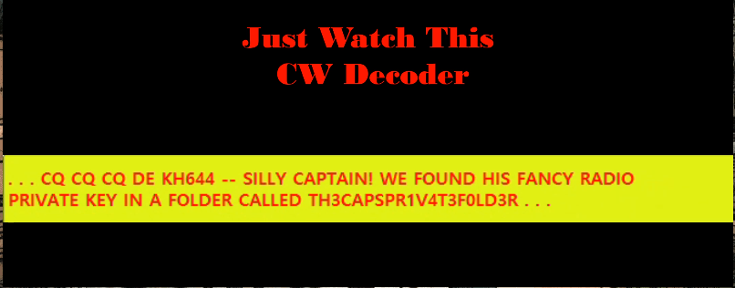{width="700"align="left"}


!!! quote ""
    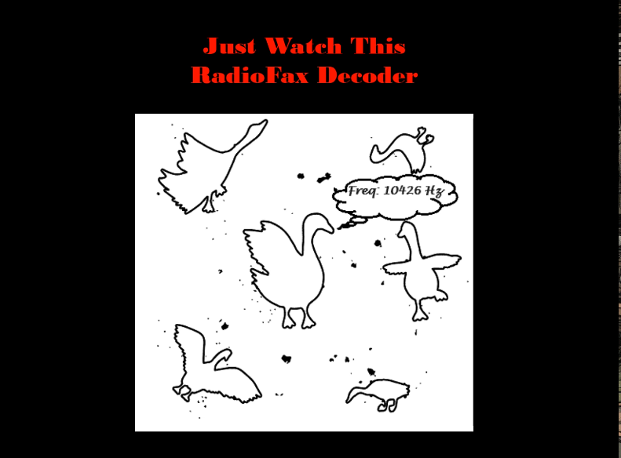{ width="500" align="right"}
    </br>We take that and set the justWatchThis cookie, and now we are able to decode all of the radio signals
    </br></br>We now have information concerning the private key
    </br></br>The frequency we need to transmit on
    </br></br>And the date and time, assuming the message there stands for 12/24 at 16:00 hours


!!! quote ""
    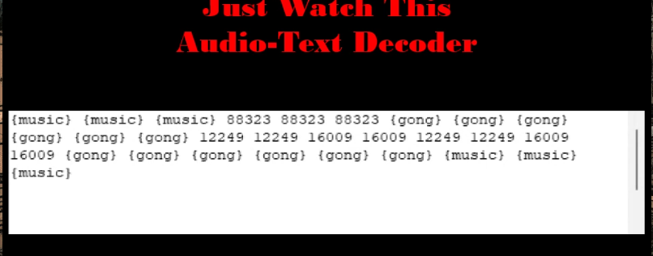{ width="700" align="left"}


The ChatNPT To-Do List mentions that the public key, capsPubKey.key is in a folder named **keys** in the same directory that rMonitor.tok is in, so **/jwtDefault/keys/capsPubKey.key**.

<figure markdown>
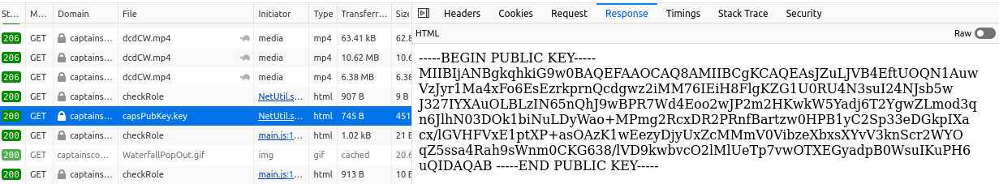{ width=900"}
</figure>

We now know the private key is in **TH3CAPSPR1V4T3F0LD3R** and as the Captain like to abbreviate, and the public key is named **capsPubKey.key**, going to guess that the filename is **capsPrivKey.Key**, so going to try **/jwtDefault/keys/TH3CAPSPR1V4T3F0LD3R/capsPrivKey.key**, again using the rDecoder token in the Authorization header.</br>
Also, as the rMonitor token was needed to access rDecoder.tok, going to assume we will need to use rDecoder to access the the private key.

<figure markdown>
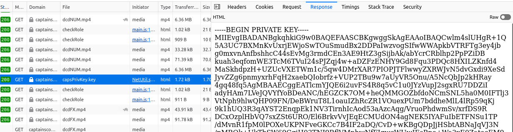{ width=900"}
</figure>

We now need an Administrator token. Looking at the radioDecoder JWT token, we see the payload looks like this:

```
{
  "iss": "HHC 2023 Captain's Comms",
  "iat": 1699485795.3403327,
  "exp": 1809937395.3403327,
  "aud": "Holiday Hack 2023",
  "role": "radioDecoder"
}
```
From the Captain's [Journal](../img/objectives/o17/journal.png), we see that he was awared the role **GeeseIslandsSuperChiefCommunicationsOfficer**, so we need to create a token with that as the role.
We setup python and install [PyJWT](https://pyjwt.readthedocs.io/en/stable/), and run the following

```python
import jwt
from cryptography.hazmat.primitives import serialization
private_key = open('/home/mark/HHC23/capcomm/capsPrivKey.key', 'r').read()
key = private_key.encode()
payload = {"iss":"HHC 2023 Captain's Comms","iat":1699485795.3403327,"exp":1809937395.3403327,"aud":"Holiday Hack 2023","role":"GeeseIslandsSuperChiefCommunicationsOfficer"}
new_token = jwt.encode(
 payload=payload,
 key=key,
 algorithm='RS256'
 )
 new_token
```

We update the **justWatchThisRole** cookie with the newly generated token and...

<figure markdown>
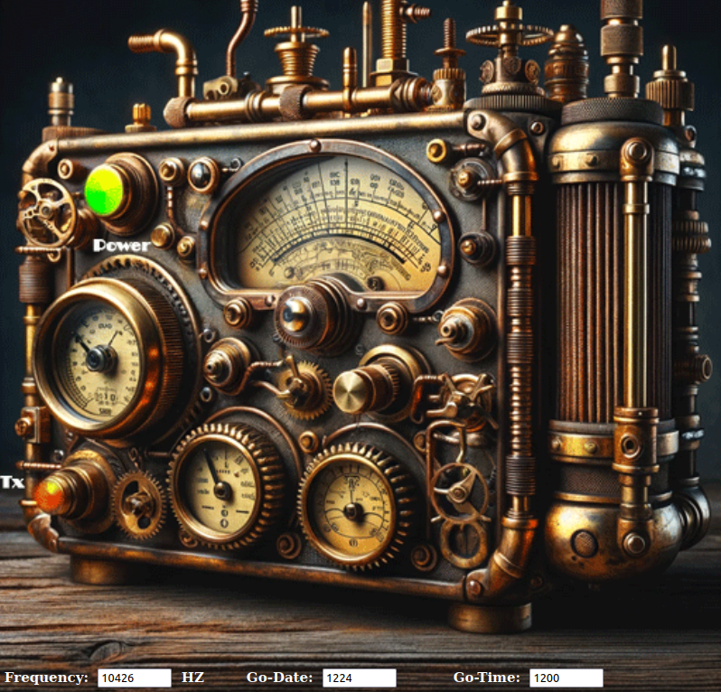{ width=900"}
</figure>

We set the Frequency to 10426Hz, the Date to 1224, and as the original time was 1600, we change that to 1200, four hours earlier. 


!!! success "Answer"
    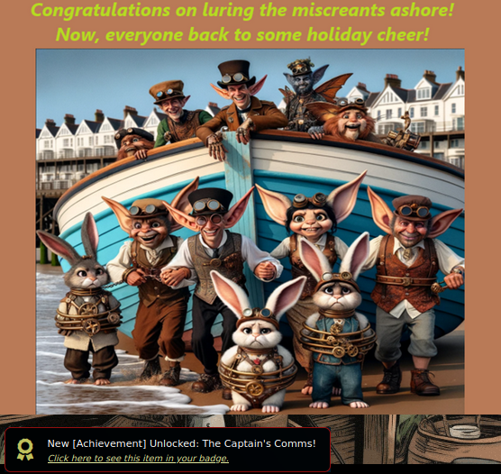

## Response

!!! quote "Chimney Scissorsticks"
    Brilliant work! You've outsmarted those scoundrels with finesse!
