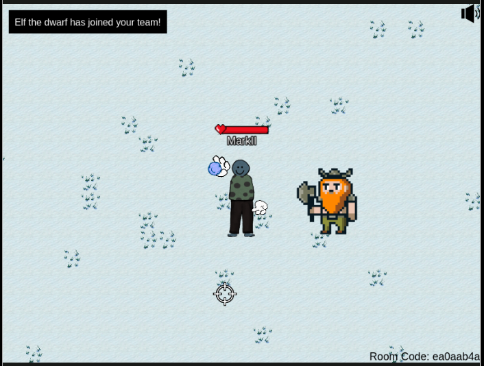
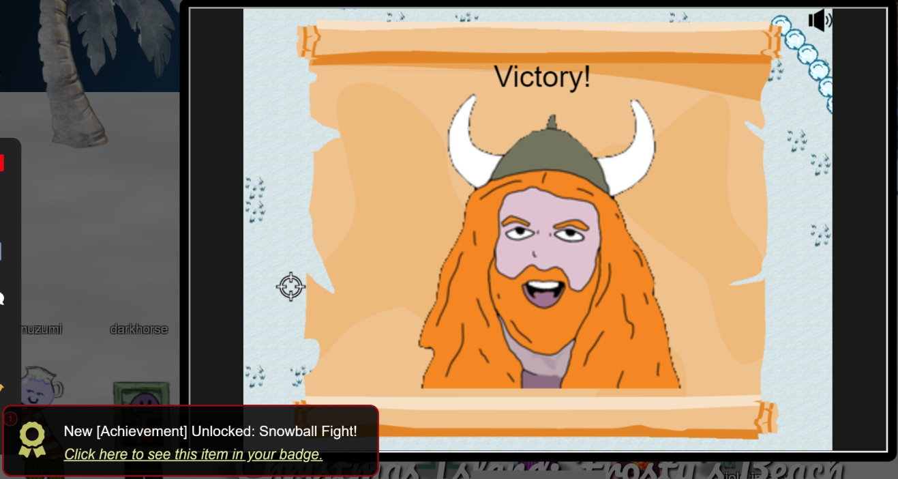

# Snowball Fight

**Difficulty**: <i class=twemoji_red>:fontawesome-solid-tree::fontawesome-solid-tree:</i>:fontawesome-solid-tree::fontawesome-solid-tree::fontawesome-solid-tree:<br/>
**Direct link**: [Snowball Hero](https://hhc23-snowball.holidayhackchallenge.com?&challenge=snowballhero)

## Objective

!!! question "Request"
    Visit Christmas Island and talk to Morcel Nougat about this great new game. Team up with another player and show Morcel how to win against Santa!

??? quote "Morcel Nougat"
    Hey there, I'm Morcel Nougat, elf extraordinaire!<br/>
    You won't believe this, but we're on a magical tropical island called Christmas Island, and it even has snow!<br/>
    I'm so glad ChatNPT suggested we come here this year!<br/>
    Santa, some elves, and I are having a snowball fight, and we'd love you to join us. Santa's really good, so trust me when I say it's way more fun when played with other people.<br/>
    But hey, if you can figure out a way to play solo by tinkering with client side variables or parameters to go solo mode, go for it!<br/>
    There's also ways to make the elves' snowballs do no damage, and all kinds of other shenanigans, but you didn't hear that from me.<br/>
    Just remember, it's all about having fun and sharing the joy of the holiday season with each other.<br/>
    So, are you in? We'd really love your company in this epic snowball battle!

## Hints

??? tip "Consoling iFrames"
    Have an iframe in your document? Be sure to [select the right context](https://gist.github.com/chrisjd20/93771da596ca5e49043f148a845c469f) before meddling with JavaScript.

??? tip "Snowball Super Hero"
    Its easiest to grab a friend play with and beat Santa but tinkering with client-side variables can grant you all kinds of snowball fight super powers. You could even take on Santa and the elves solo!

## Solution


Using the browser developer tools we access Snowball Hero and load a Private game vs Santa. We see via the network tab that the following is loaded:</br>
https://hhc23-snowball.holidayhackchallenge.com/room/?username=UserX&roomId=11d762bbe&roomType=private&gameType=co-op&id=3022515c-70fb-4355-901c-66e9b6113876&dna=ATATATATATATATATATATATATATATATATATATATATATATATATATATATATATATATATATATATATATATATATATATATATATATATATATATATATATATATATATATATAT

Looking at the application html code, we see the defaults: 

```javascript hl_lines="8" title="Parameters"
var paramsDefaults = { 
    "username": nms[ Math.floor(Math.random() * nms.length) ] + (Math.random() + 1).toString(36).substring(10), 
    "roomId": "0", 
    "roomType": "public", 
    "gameType": 'free-for-all', 
    "id": generateUUIDv4(), 
    "dna": 'avatar' + (Math.floor(Math.random() * 9) + 1), 
    "singlePlayer":"false" 
```

I used the developer tools, Inspect to find and then modify the iframe source to add the "singlePlayer" variable:

```html 
<div class="modal-frame challenge challenge-snowballhero">
    <iframe title="challenge" src="https://hhc23-snowball.holidayhackchallenge.com/room/?username=UserX&amp;roomId=11d762bbe&amp;roomType=private&amp;gameType=co-op&amp;id=3022515c-70fb-4355-901c-66e9b6113876&amp;dna=ATATATATATATATATATATATATATATATATATATATATATATATATATATATATATATATATATATATATATATATATATATATATATATATATATATATATATATATATATATATAT&amp;singlePlayer=true">
    </iframe>
</div>
```
<figure markdown>

</figure>


We still sustain damage when being hit and as no one does snowball fights better than Santa, we lose if we aren't  careful, even with Elf's help

We do find the following parameters:

```javascript hl_lines="4"
  var elfThrowDelay = 2000
  var projectiles
  var snowballLiveTime = 2500
  var snowballDmg = 2
  var snowballSpeed = 500
  var santaObject
  var santaThrowDelay = 500
  var playersVelocity = 200
```
And if we go to the developer tools console and modify things during gameplay:

```javascript
snowballDmg = -2
playersVelocity = 2000
santaThrowDelay = 5000
elfThrowDelay = 5000
```
We regain any damage taken and:

!!! success "Answer"
    

## Response

!!! quote "Morcel Nougat"
    You're like a snowball fighting ninja! A real-life legend. Can I have your autograph!?
