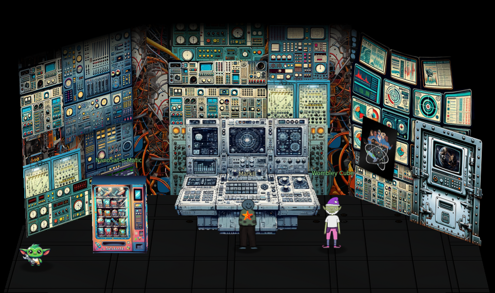
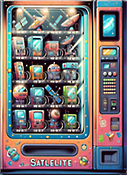
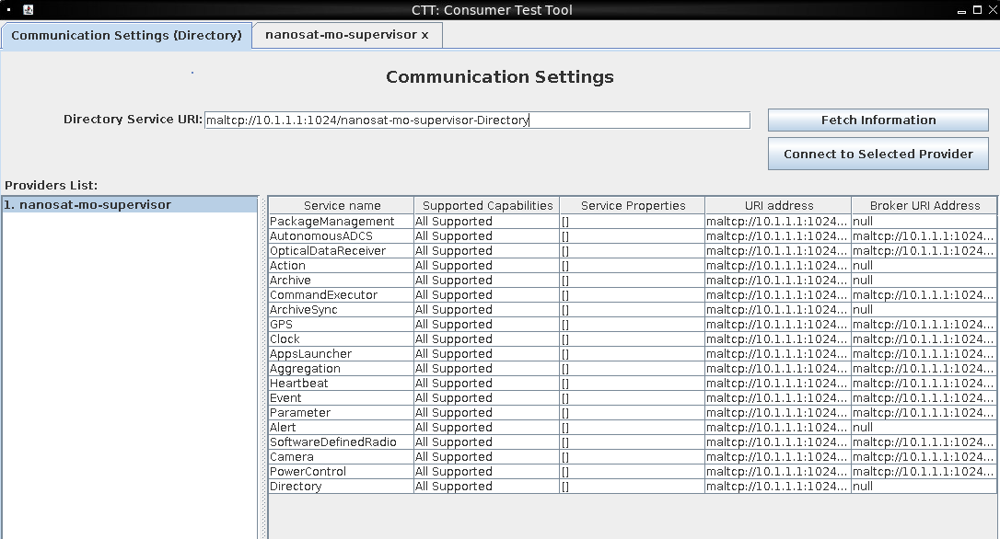
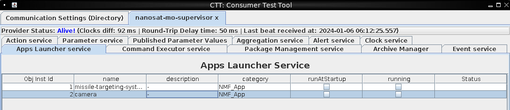
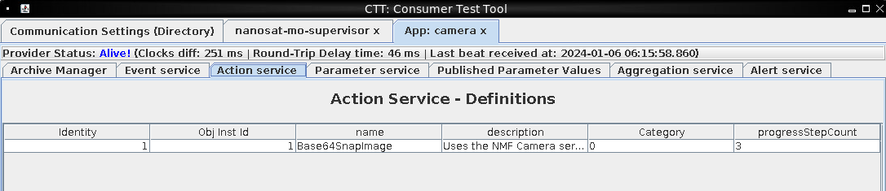
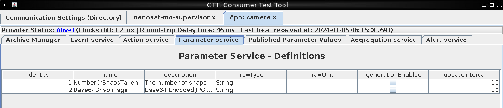
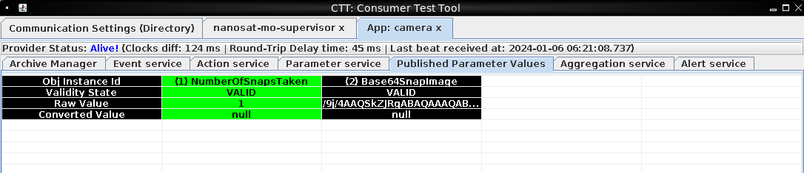
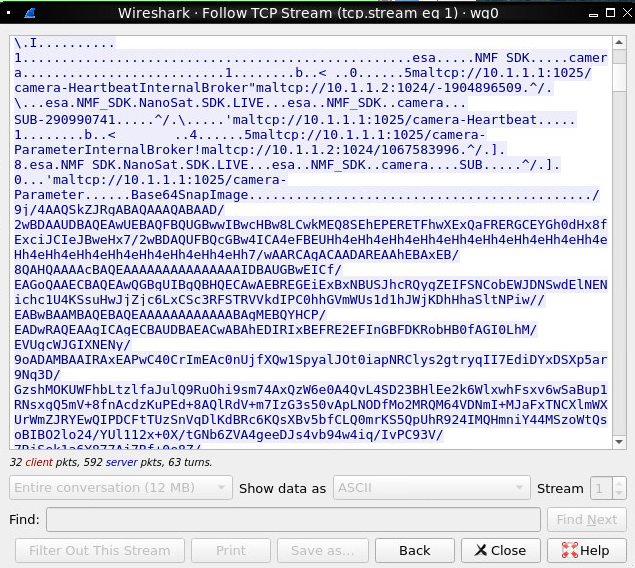
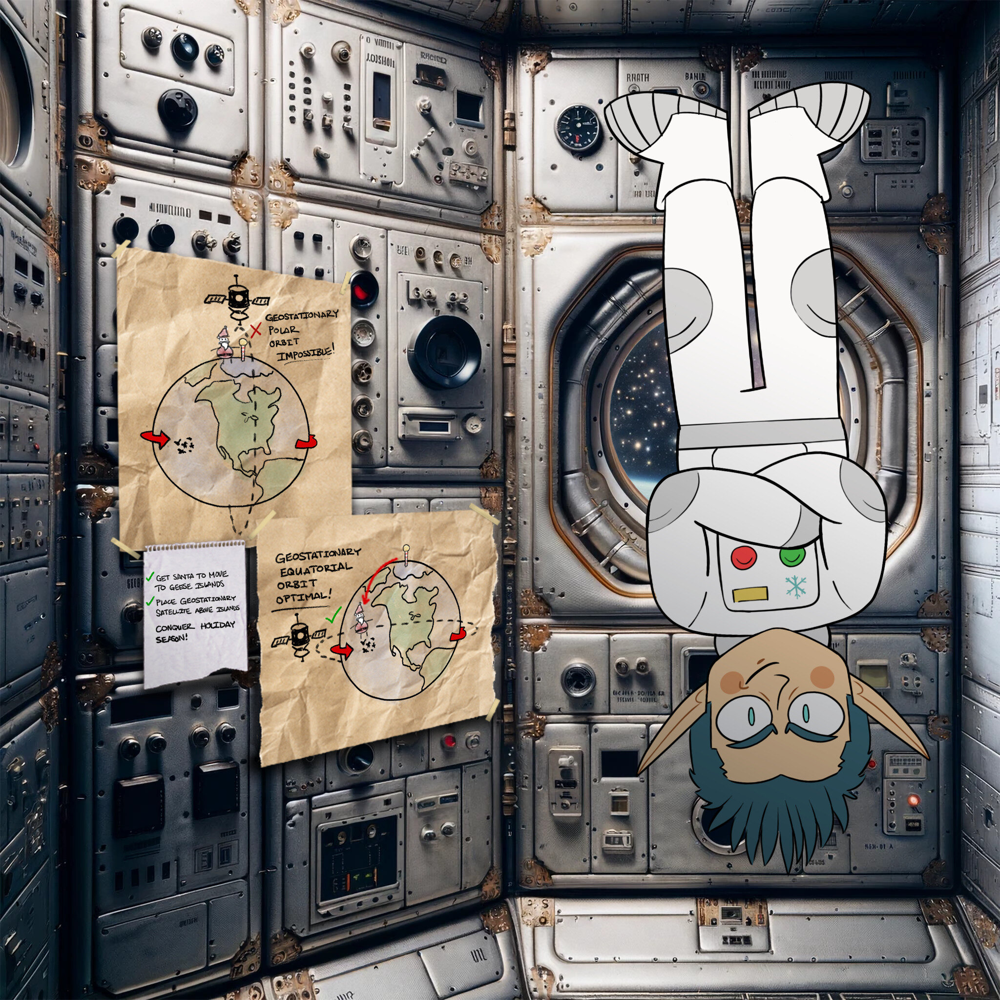

# Camera Access

**Difficulty**: <i class=twemoji_red>:fontawesome-solid-tree::fontawesome-solid-tree::fontawesome-solid-tree:</i>:fontawesome-solid-tree::fontawesome-solid-tree:<br/>
**Direct link**: [NanoSat](https://nanosat.one?&challenge=satmissile&id=48ac723e-c8d7-41be-9170-f7698d9b91da&area=si-zenithsgs&tokens=satmissile)

## Objective

!!! question "Request"
    Gain access to Jack's camera. What's the third item on Jack's TODO list?

??? quote "Wombley Cube"
    This is Ground Control, do you read me...? Ground Control to -- </br>
    Hey! How'd you get in here? That tram is the only accessible point of entry and I secured it with MFA!</br>
    No matter, you may have had the skills to find and infiltrate the satellite ground station, but there's no chance you can hack your way into the satellite itself!</br>
    The nanosat's Supervisor Directory will remain hidden, and you'll never discover the mastermind behind all this.</br>
    So don't even waste your time trying.

## Hints

??? tip "Hubris is a Virtue"
    In his hubris, Wombley revealed that he thinks you won't be able to access the satellite's "Supervisor Directory". There must be a good reason he mentioned that specifically, and a way to access it. He also said there's someone else masterminding the whole plot. There must be a way to discover who that is using the nanosat.


## Solution

<figure markdown>
{ width="600"}
</figure>

!!! quote "NanoSat-o-Matic"
    { width="200", align="right"}
    Hi there! I am a Ground station client vending machine. Apparently there is a huge need for NanoSat frameworks here, so they have put me in this room. Here, have a [free sample](https://www.holidayhackchallenge.com/2023/client_container.zip)!

We download the Ground Station client provided by the vending machine and follow the instructions in the README.md to setup docker, the image, and get it up and running.

We connect to the container using VNC, and configure the [Wireguard](https://www.wireguard.com/) client with the information provided by [NanoSat Comms](https://nanosat.one?&challenge=satmissile&id=48ac723e-c8d7-41be-9170-f7698d9b91da&area=si-zenithsgs&tokens=satmissile).

I copied the config to a local text file and then used docker tools to copy the file over

```
docker ps #identify the container id
docker cp ./wg0.conf <id>:/root/wg0.conf
```
And then within the container

```
mv wg0.conf /etc/wireguard/
wg-quick up wg0
```
We run the NanoSat MO Base Station Tool and connect to **maltcp://10.1.1.1:1024/nanosat-mo-supervisor-Directory**

<figure markdown>
{ width="600"}
</figure>

We also run Wireshark and connect it to the wg0 interface to monitor traffic.

Going through the tabs, we come across the **Apps Launcher Service** and we see an option for **Camera**

<figure markdown>
{ width="700"}
</figure>

We see it start and gives us a new URI to connect to : **maltcp://10.1.1.1:1025/camera-Directory**

We connect to that and again, peruse the tabs. The Action and Parameter Service tabs look interesting

<figure markdown>
{ width="700"}
{ width="700"}
</figure>

On the Parameter service tab, we enable Base64SnapImage and NumberofSnapsTaken
We go to Action Services and click Submit Action for Base64SnapImage
We then go to Published Parameters Values and see for Base64SnapImage, we have the start of a Base64 string:

<figure markdown>
{ width="700"}
</figure>

We move over to Wireshark and notice the base64 values in packets, so we click on one and Follow Stream

<figure markdown>
{ width="500"}
</figure>

We carefully save that bas64 text to a file so as not to include more than necessary, nor less, and then decode it.

```
$ base64 -d capture.b64 > capture_camera.jpg
```
<figure markdown>
{ width="600"}
</figure>


!!! success "Answer"
    Conquer Holiday Season!

## Response

!!! quote "Insert Elf Name"
    Copy the final part of the conversation with Elf Name here.
