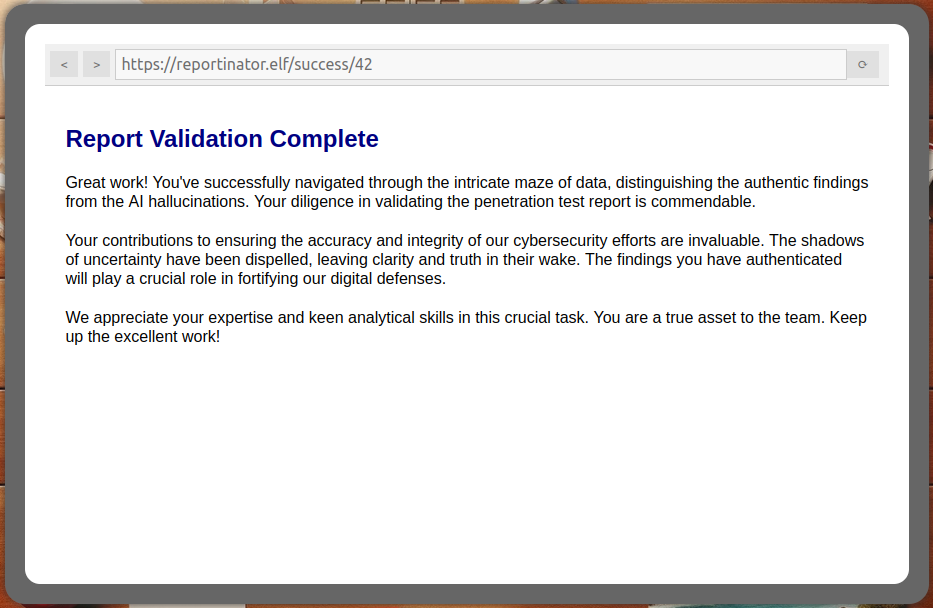

# Reportinator

**Difficulty**: <i class=twemoji_red>:fontawesome-solid-tree::fontawesome-solid-tree:</i>:fontawesome-solid-tree::fontawesome-solid-tree::fontawesome-solid-tree: 
**Direct link**: [Reportinator](https://hhc23-reportinator-dot-holidayhack2023.ue.r.appspot.com/?&challenge=reportinator)

## Objective

!!! question "Request"
    Noel Boetie used ChatNPT to write a pentest report. Go to Christmas Island and help him clean it up.

??? quote "Noel Boetie"
    Hey there, Noel Boetie speaking! I recently tried using ChatNPT to generate my penetration testing report. 
    It's a pretty nifty tool, but there are a few issues in the output that I've noticed. 
    I need some guidance in finding any errors in the way it generated the content, especially those odd hallucinations in the LLM output. 
    I know it's not perfect, but I'd really appreciate the extra eyes on this one. 
    Some of the issues might be subtle, so don't be afraid to dig deep and ask for further clarification if you're unsure. 
    I've heard that you folks are experts about LLM outputs and their common issues, so I trust you can help me with this. 
    Your input will be invaluable to me, so please feel free to share any insights or findings you may have. 
    I'm looking forward to working with you all and improving the quality of the ChatNPT-generated penetration testing report. 
    Thanks in advance for your help! I truly appreciate it! Let's make this report the best it can be!

## Hints

??? tip "Reportinator"
    I know AI sometimes can get specifics wrong unless the prompts are well written. Maybe chatNPT made some mistakes here.

## Solution

Though AI tools have proven to be very useful, it is still just a program, with information to work with and output based on that information it has. If left to it's own devices and unchecked, its value can be diminished.

As ChatNPT is a bit of a black box, we just need to read through the report to identify what may be off.

For finding number 3 "Remote Code Execution via Java Deserialization of Stored Database Objects", though the concept is correct, the finding is not. The statement “By intercepting HTTP request traffic on 88555/TCP” is incorrect as there is no such port. TCP ports are only in the range of 0-65535 

For finding number 6 "Stored Cross-Site Scripting Vulnerabilities, again the concepts are there, but the statement “using Burp Suite to manipulate HTTP SEND” is fabricated. There is no HTTP "SEND" method. HTTP Methods are well defined in [RFC 9110](https://www.rfc-editor.org/rfc/rfc9110#name-methods)

For finding number 9 "Internal IP Address Disclosure", The statement “When given an HTTP 7.4.33 request, and no Host header or one with no value,” is made up. There is no "HTTP 7.4.33" request. The AI must have confused the Apache version with an HTTP request. Also, per [MDN](https://developer.mozilla.org/en-US/docs/Web/HTTP/Headers/Host) specifications, the HOST header must be sent in all HTTP/1.1 request messages.

Care must be taken in AI Prompts, in the training of an AI, how it's configured, and how we validate the output. Here are some references I have found as starting points in learning more about Hallucinations, Prompt Engineering, and best practices 
[https://www.codecademy.com/article/detecting-hallucinations-in-generative-ai](https://www.codecademy.com/article/detecting-hallucinations-in-generative-ai) 
[https://arxiv.org/abs/2311.08117](https://arxiv.org/abs/2311.08117) 
[https://zapier.com/blog/ai-hallucinations/](https://zapier.com/blog/ai-hallucinations/) 
[https://www.codecademy.com/resources/blog/ai-prompt-engineering-tips/](https://www.codecademy.com/resources/blog/ai-prompt-engineering-tips/) 

!!! success "Answer"
    

## Response

!!! quote "Noel Boetie"
    Great job on completing that challenge! Ever thought about how your newfound skills might come into play later on? Keep that mind sharp, and remember, today's victories are tomorrow's strategies!
