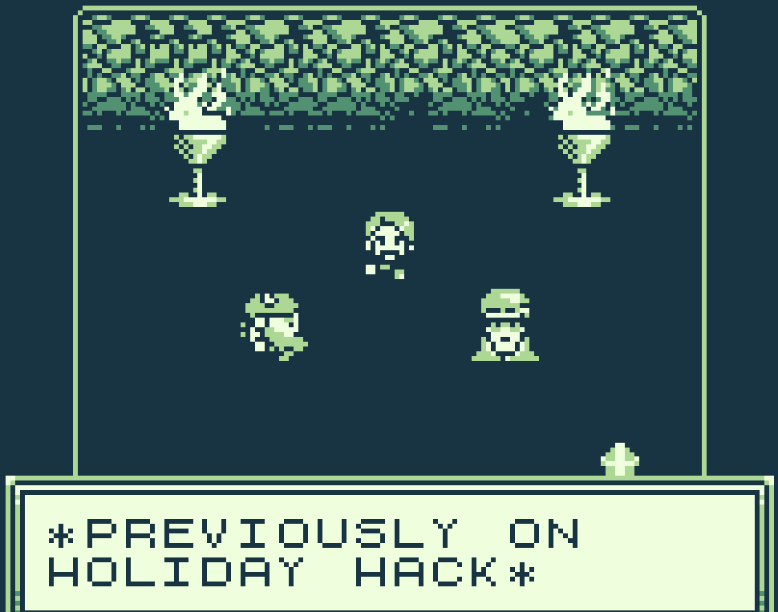
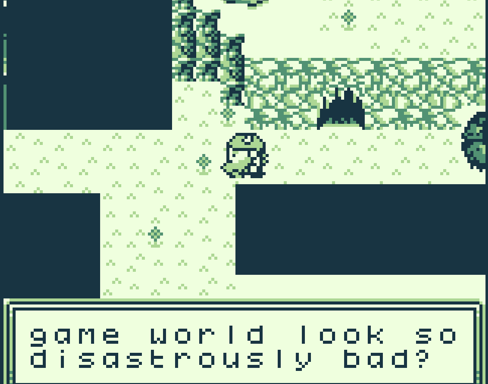
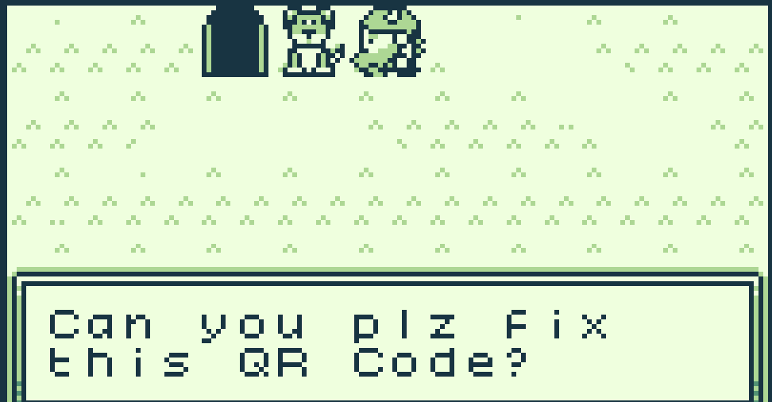
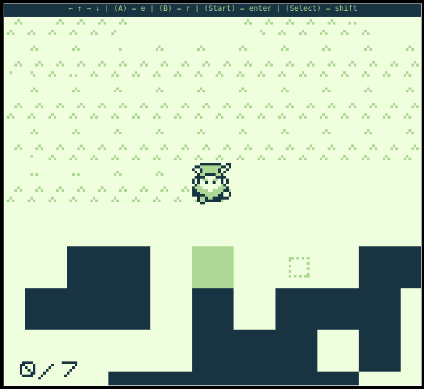
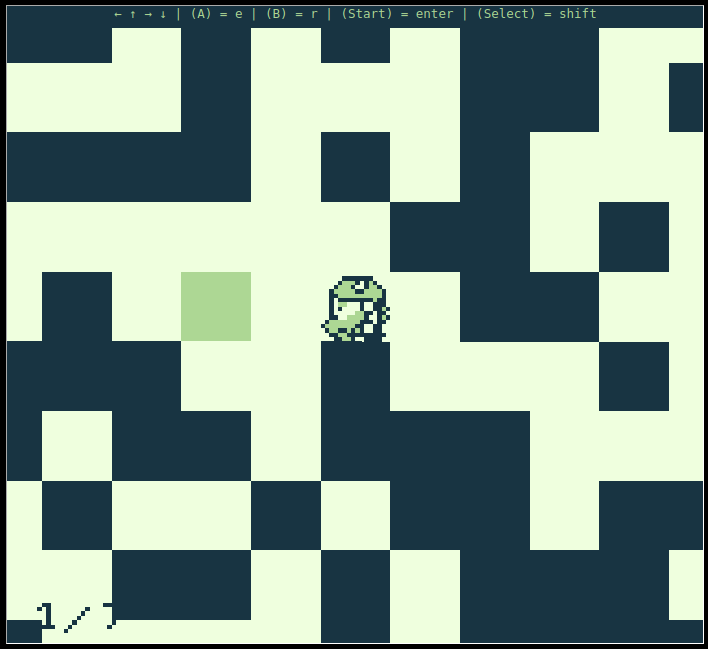
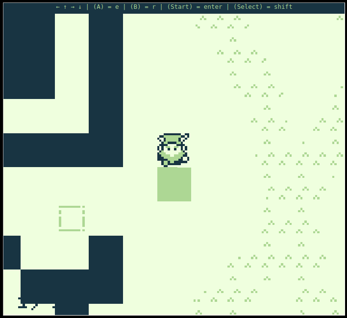
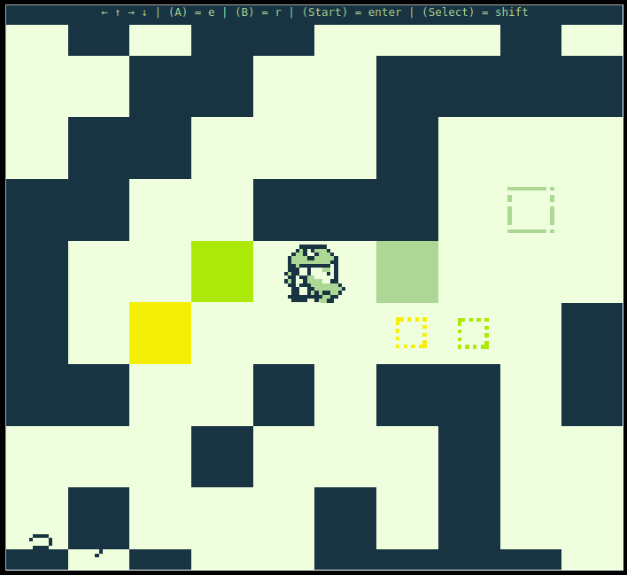
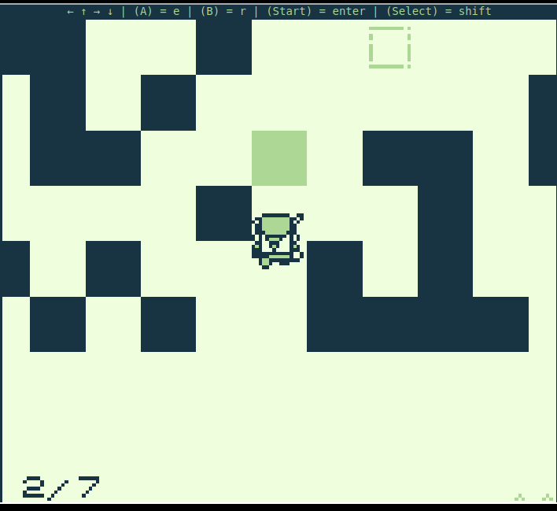
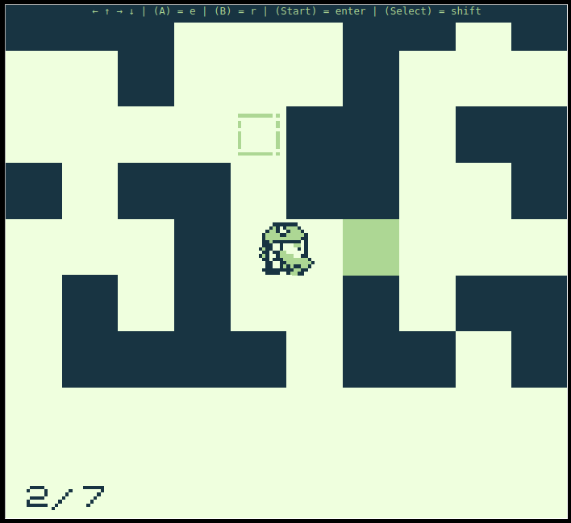
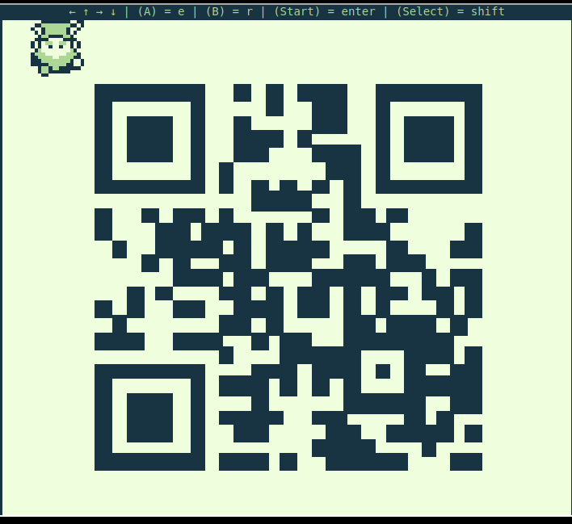

# Game Cartridges: Vol 1

**Difficulty**: <i class=twemoji_red>:fontawesome-solid-tree:</i>:fontawesome-solid-tree::fontawesome-solid-tree::fontawesome-solid-tree::fontawesome-solid-tree:<br/>
**Direct link**: [GameBoy1](https://gamegosling.com/vol1-uWn1t6xv4VKPZ6FN/index.html?&challenge=gameboy1)

## Objective

!!! question "Request"
    Find the first Gamegosling cartridge and beat the game

??? quote "Dusty Giftwrap"
    Arrr, matey, shiver me timbers! There be buried treasure herrrrre.<br/>
    Just kidding, I'm not really a pirate, I was just hoping it would make finding the treasure easier.<br/>
    I guess you heard about the fabled buried treasure, too? I didn't expect to see anyone else here. This uncharted islet was hard to find.<br/>
    There are 3 buried treasures in total, each in its own uncharted area around Geese Islands.<br/>
    I've been searching for hours now with no luck, and these strange toys are starting to give me the creeps.<br/>
    Maybe you'll be able to find it. Here, use my Gameboy Cartridge Detector. Go into your items and test it to make sure it's still working.<br/>
    When you get close to the treasure, it'll start sounding off. The closer you get, the louder the sound.<br/>
    No need to activate or fiddle with it. It just works!<br/>
    I bet one of these creepy toys has the treasure, and I'm sure not going anywhere near them!<br/>
    If you find the treasure, come back and show me, and I'll tell you what I was able to research about it.<br/>
    Good luck!

## Hints

??? tip "Gameboy 1"
    1) Giving things a little push never hurts. 2) Out of sight but not out of ear-shot 3) You think you fixed the QR code? Did you scan it and see where it leads?


## Solution

It's been a while since I've played a Gameboy game. It's bringing me back.

After loading and starting a new game, we go through our introductions and move through the map</br>

!!! quote ""
    { width="400" align="left"}
    { width="400" align="right"}
    </br>*Ugh!* Why in the world does the game world look so disastrously bad?</br> </br> *GRUMBLE** </br> 
      When I find the ne'er-do-weller who skimped out on the assets for this game!


!!! quote ""
    { width="500" align="left"}
      <figcaption>*Woof* Hi, I'm Kody!</br> Can you plz fix this QR Code? The developers cheaped out and now a few using-song blocks are not in the correct position.</br> If you sing to the blocks that are misplaced, they will sing back!</br> Try singing to the block to the south of my position. Hopefully you can fix the misaligned QR blocks.</figcaption>

<figure markdown>
{ width="400"}
</figure>

!!! quote ""
    { width="400" align="left"}
    { width="400" align="right"}
    </br>This one we had to move </br>out and around, looking </br>for the spot as it wasn't </br>in the immediate area


<figure markdown>
{ width="500"}
<figcaption>It's very important to do blocks 3-7 in order, otherwise you won't be able to move them</figcaption>
</figure>

!!! quote ""
    { width="400" align="left"}
    { width="400" align="right"}

<figure markdown>
{ width="400"}
</figure>

We scan the QR code which gives us the website [https://8bitelf.com/](https://8bitelf.com/)

```
$ curl https://8bitelf.com
<html>
	<body>
		<p>flag:santaconfusedgivingplanetsqrcode</p>
	</body>
</html>
```

!!! success "Answer"
    santaconfusedgivingplanetsqrcode

## Response

!!! quote "Insert Elf Name"
    Whoa, you found it!</br>
    It's a... video game cartridge? Coooooollll... I mean, arrrrrr....</br>
    So, here's what my research uncovered. Not sure what it all means, maybe you can make sense of it.</br>
    </br>
    You have all three? I think that makes you ruler of the pirates!
