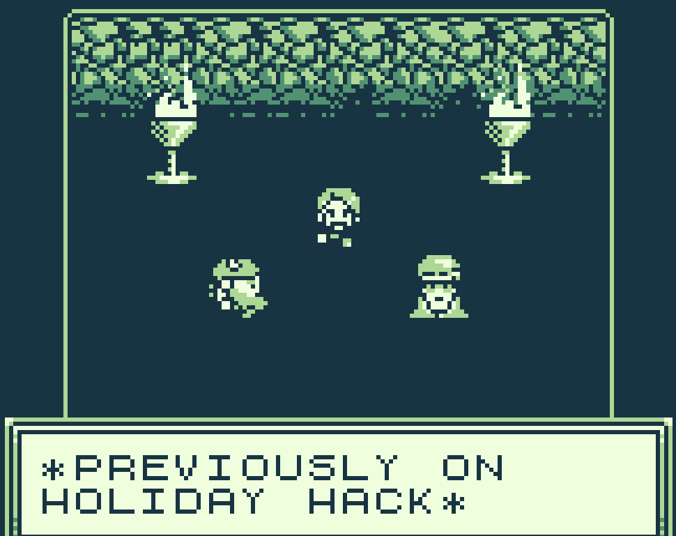
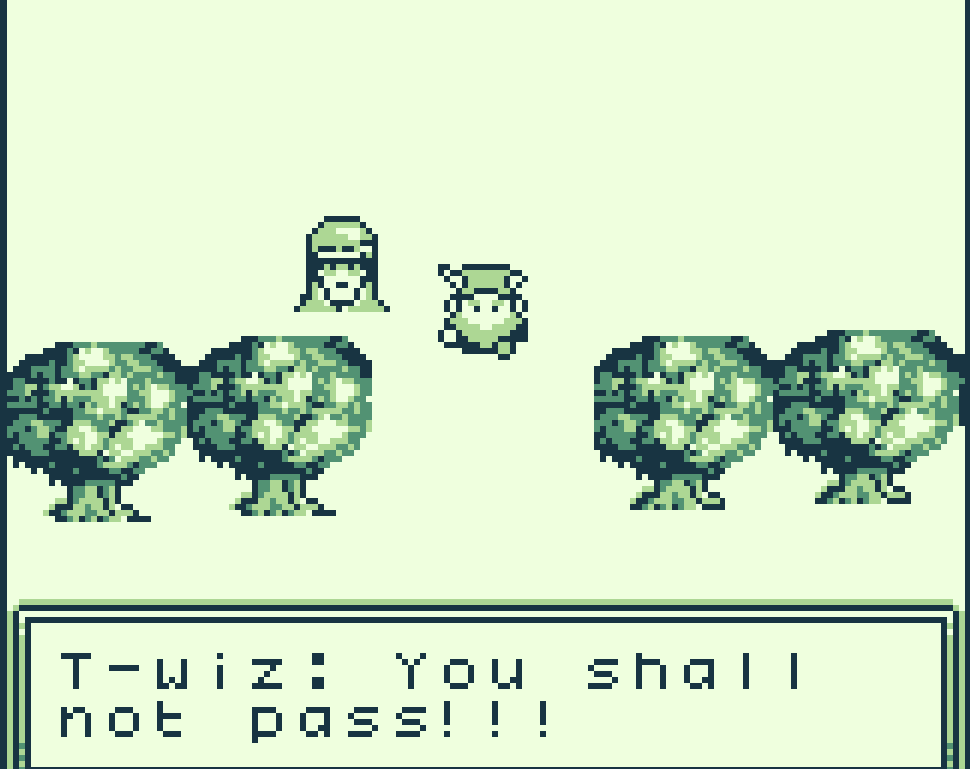
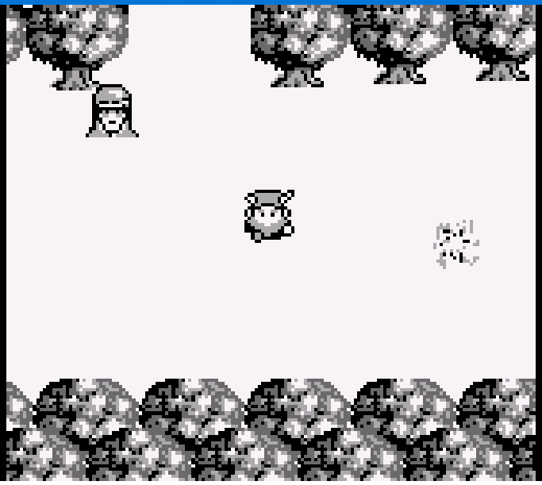
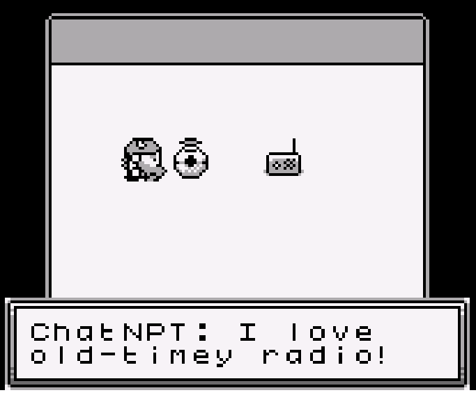

# Game Cartridges: Vol 2

**Difficulty**: <i class=twemoji_red>:fontawesome-solid-tree::fontawesome-solid-tree::fontawesome-solid-tree:</i>:fontawesome-solid-tree::fontawesome-solid-tree:<br/>
**Direct link**: [GameBoy2](https://gamegosling.com/vol2-akHB27gg6pN0/index.html?&challenge=gameboy2)

## Objective

!!! question "Request"
    Find the second Gamegosling cartridge and beat the game

??? quote "Tinsel Upatree"
    I can't believe I was actually able to find this underground cavern!<br/>
    I discovered what looked liike an old pirate map in the attic of one of those huts in Rainraster Cliffs, and it actually led somewhere!<br/>
    But now that I've seen where it leads, I think this might've been a bad idea. This place is scary! Maybe you want to take it from here?

## Hints

??? tip "Gameboy 2"
    1) This feels the same, but different! 2) If it feels like you are going crazy, you probably are! Or maybe, just maybe, you've not yet figured out where the hidden ROM is hiding. 3) I think I may need to get a DIFFerent perspective. 4) I wonder if someone can give me a few pointers to swap.


## Solution

We appear to start Vol 2 in the same manners as Vol 1

!!! quote ""
    { width="400" align="left"}
    { width="400" align="right"}
    </br>*PREVIOUSLY ON HOLIDAY HACK*</br>Jared: Elf, have you ever heard of a miner named Tom Liston?</br>Elf: Blah blah blah... I'm not listening to this again! Glooooooory! </br></br> T-wiz: You shall not pass!!!</br>*CHUCKLE*</br>I've always wanted to say that!

But we appear to be stuck. There were comments of a different version. 

Looking at the developer tools, network tab, we see game loaded [https://gamegosling.com/vol2-akHB27gg6pN0/rom/game1.gb](https://gamegosling.com/vol2-akHB27gg6pN0/rom/game1.gb)
The console shows: rom/game1.gb, and [https://gamegosling.com/vol2-akHB27gg6pN0/js/script.js](https://gamegosling.com/vol2-akHB27gg6pN0/js/script.js) shows the following :

``` javascript
// User configurable.
const ROM_FILENAME = "rom/game";
...
// Load a ROM.
(async function go() {
  let ranNum = Math.round(Math.random()).toString()
  let filename = ROM_FILENAME + ranNum + ".gb";
  console.log(filename);
  let response = await fetch(filename);
  let romBuffer = await response.arrayBuffer();
  const extRam = new Uint8Array(JSON.parse(localStorage.getItem("extram")));
  Emulator.start(await binjgbPromise, romBuffer, extRam);
  emulator.setBuiltinPalette(vm.palIdx);
})();
```
According to [MDN](https://developer.mozilla.org/en-US/docs/Web/JavaScript/Reference/Global_Objects/Math/random) 
!!! quote
    The Math.random() static method returns a floating-point, pseudo-random number that's greater than or equal to 0 and less than 1

And with the rounding, means that the file is going to be either game0.gb or game1.gb.
As we have game1.gb, let's download [game0.gb](https://gamegosling.com/vol2-akHB27gg6pN0/rom/game0.gb)

=== "Linux Diff"

    ``` bash
    diff <(xxd game0.gb) <(xxd game1.gb)
    ```
=== "Windows Powershell"

    ``` powershell
    Compare-Object (Format-Hex .\game0.gb) (Format-Hex .\game1.gb)
    ```

We are provided with the following output with game0 indicated by <, and game1 indicated by >

```cmd
21c21
< 00000140: 0000 0000 3030 001b 0203 0033 0142 71b3  ....00.....3.Bq.
---
> 00000140: 0000 0000 3030 001b 0203 0033 0142 7186  ....00.....3.Bq.
90c90
< 00000590: 5405 050b 4b9a 2300 0000 0000 06ad 4210  T...K.#.......B.
---
> 00000590: 5405 05d2 ac3d 2d00 0000 0000 06ad 4210  T....=-.......B.
5801c5801
< 00016a80: 2080 0c80 0300 000f f807 0000 0000 0f10   ...............
---
> 00016a80: 2080 0c80 0b00 000f f807 0000 0000 0f10   ...............
5804c5804
< 00016ab0: 0000 0000 2000 0600 0900 000f f807 0000  .... ...........
---
> 00016ab0: 0000 0000 2000 0600 0600 000f f807 0000  .... ...........
6089c6089
< 00017c80: 0200 fe80 002a 0013 fffe fffb 13ff ffff  .....*..........
---
> 00017c80: 0100 fe80 002a 0013 fffe fffb 13ff ffff  .....*..........
6225,6226c6225,6226
< 00018500: 1204 2103 c60d 5701 1400 00ff fc14 0280  ..!...W.........
< 00018510: fffd 140b 80ff fe35 fffc 3200 fffc 2703  .......5..2...'.
---
> 00018500: 1204 2103 c60d 5701 1400 00ff fc14 0300  ..!...W.........
> 00018510: fffd 1404 00ff fe35 fffc 3200 fffc 2703  .......5..2...'.
```
Let's take game0.gb, and update it with the information from game1.gb, one line at a time, and try to run the modified version.

I found [https://web.libretro.com/](https://web.libretro.com/) as an online emulator, or [https://emulicious.net/](https://emulicious.net/) as a potential local emulator. I'm sure there are many others, so players, use your tool of choice.

Changing byte 0x14F from B3 to 86 did not make any change. 
0x593 to 0x596 has a few bytes so left that alone and moved to 0x16a84 and changed 03 to 0B.

<figure markdown>
{ width="400"}
</figure>

We have a portal!

<figure markdown>
{ width="400"}
</figure>

Playing the radio gives us the following morse code:

```
--. .-.. ----- .-. -.— 
```
Using [International Morse Code](https://en.wikipedia.org/wiki/Morse_code#/media/File:International_Morse_Code.svg) reference, we can then translate that to our answer


!!! success "Answer"
    GL0RY

## Response

!!! quote "Tinsel Upatree"
    Whoa, you found it!<br/>
    What version is it?<br/>
    Did you know that many games had multiple versions released? Word is: volume 2 has 2 versions!<br/>
    <br/>
    You have all three? What a glorious collection!<br/>
